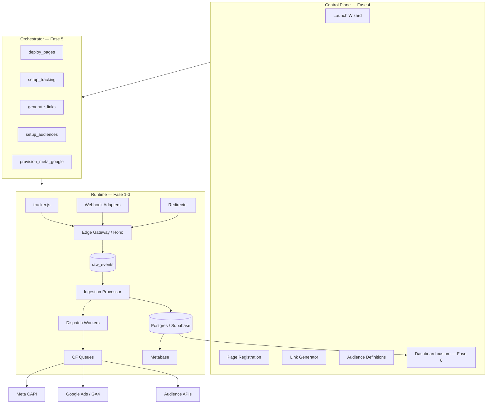
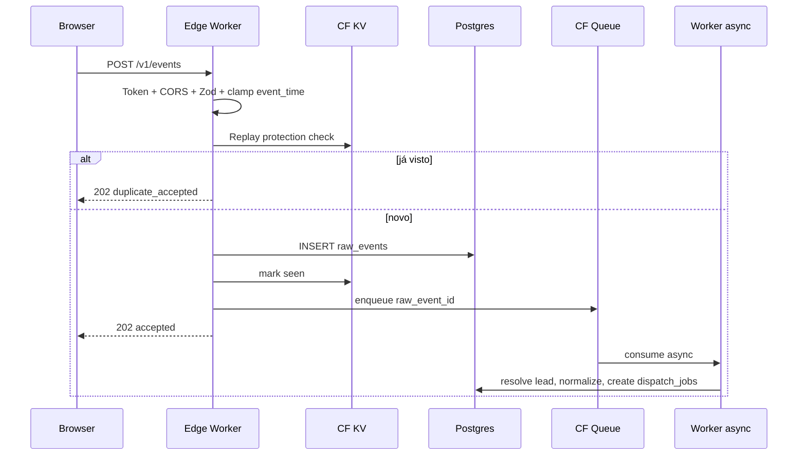

# 01 — Visão geral arquitetural

## Camadas

GlobalTracker é organizado em 3 camadas independentes (Seção 6 do `planejamento.md` v3.0):

## Princípio: Runtime independente

Runtime é a única camada necessária para gerar valor. Control Plane e Orchestrator são aceleradores — sistema funciona sem eles (operador usa YAML manual + secret manager).

## Fluxo de request (`/v1/events`)

## Componentes

| Componente | Tecnologia | Fase |
|---|---|---|
| Edge Gateway | Cloudflare Workers + Hono | 1 |
| Ingestion Processor | CF Queue consumer | 1-2 |
| Database | Postgres via Supabase + Drizzle ORM + Hyperdrive | 1 |
| Cache / KV | Cloudflare KV | 1 |
| Queues | Cloudflare Queues (at-least-once) | 1 |
| Crons | CF Cron Triggers | 3 |
| Tracker | TS vanilla < 15KB gz | 2 |
| LP Templates | Astro + Cloudflare Pages | 5 |
| Control Plane | Next.js 15 App Router + shadcn | 4 |
| Orchestrator | Trigger.dev | 5 |
| Analytics | Metabase em Postgres views | 3 |
| Dashboard custom | Next.js + Supabase Realtime | 6 |

## Multi-tenancy

`workspace_id` em todas as tabelas + RLS no Postgres + crypto key derivada por workspace via HKDF. Detalhe em [`02-stack.md`](02-stack.md) e [`03-data-layer.md`](03-data-layer.md).

## Privacy by design

- PII em 3 categorias: hash, encrypted, transient (`10-product/06-glossary.md`).
- `pii_key_version` por registro permite rotação.
- Logs sanitizados centralmente.
- SAR via endpoint admin.

Decisões fundamentais em [`../90-meta/04-decision-log.md`](../90-meta/04-decision-log.md).
