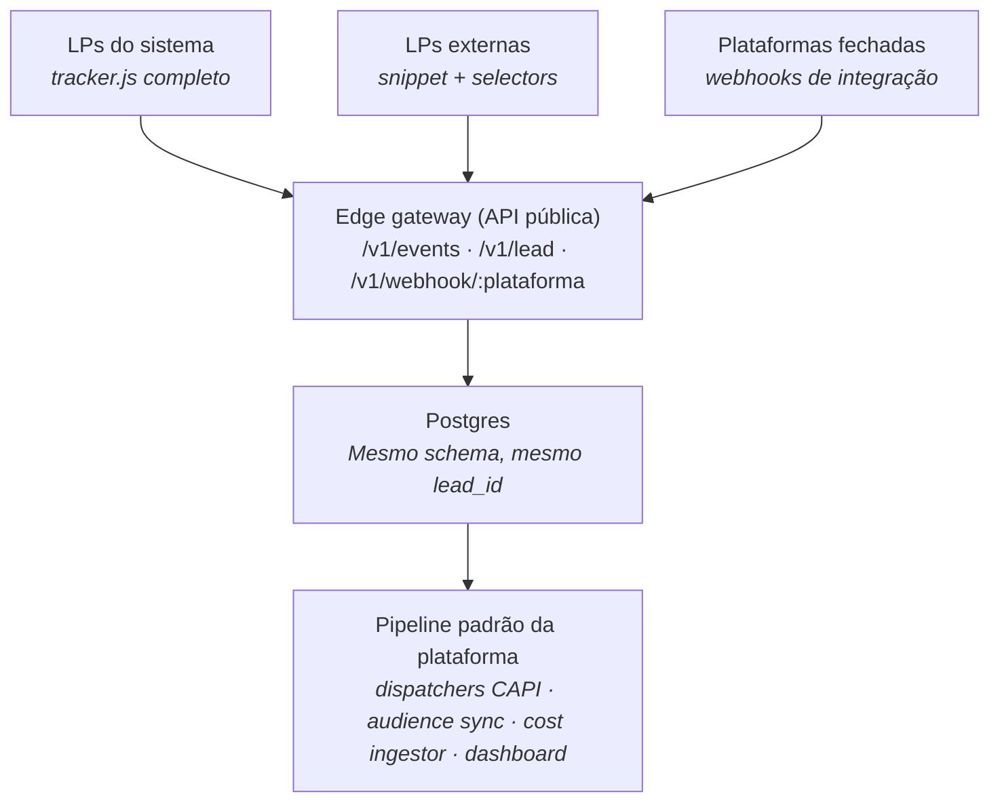

# Plataforma Interna de Lançamentos — Planejamento Técnico

> **Para o Claude Code:** Este documento é a especificação completa de um sistema que está sendo construído do zero. Todas as decisões arquiteturais e de stack já foram tomadas e estão registradas aqui. Sua tarefa é executar a construção seguindo o que está definido, não rediscutir decisões. Comece sempre pela Fase 1 (Seção 17) a menos que seja explicitamente direcionado a outra parte. Quando algo não estiver definido neste documento, pergunte antes de assumir.

---

## 1. Visão geral

Plataforma interna para automatizar a operação de lançamentos de infoprodutos: tracking, atribuição, integração com Meta Ads e Google Ads via Conversions API, gestão de públicos, observabilidade em tempo real e (em fases posteriores) geração assistida de páginas e provisionamento automático de campanhas.

**Problema que resolve.** Hoje cada lançamento gasta dias configurando manualmente: GTM com tags por página, container Stape pra server-side, públicos no Meta e Google, pixel, eventos de conversão, links rastreáveis. Tudo manual, desconectado, sem fonte única de verdade. Esta plataforma centraliza a operação em um banco e expõe APIs/UIs que automatizam o que hoje é repetitivo.

**Princípio de design fundamental.** O sistema é construído em camadas independentes. As camadas inferiores (runtime de tracking + analytics) **não dependem** das superiores (gerador de páginas, wizard, orquestrador). Isso significa que LPs de terceiros, hospedadas em qualquer lugar, conseguem usar o sistema através de três modos de integração descritos na Seção 5.

## 2. Visão de uso end-to-end

Quando completo, o fluxo de uso pelo profissional de marketing é:

1. Abre o Launch Wizard, define produto, datas, ICP, copy brief
2. Sistema gera 3 variantes de LP de captura e 3 de página de vendas via IA
3. Profissional revisa, edita, aprova
4. Define orçamento por canal e seleciona públicos
5. Clica deploy → orquestrador provisiona LPs, campanhas Meta/Google, públicos, tracking, links curtos por canal
6. Distribui os links curtos onde quiser (anúncios já criados, posts orgânicos, WhatsApp, parceiros)
7. Acompanha o lançamento no dashboard em tempo real: funil, atribuição por canal/anúncio, CPL, ICP%, conversão, ROAS

Em modo "LP externa", os passos 2-3 são substituídos por "registrar LPs já existentes e gerar snippet de tracking". Tudo o mais permanece igual.

## 3. Arquitetura em camadas

A plataforma se organiza em três camadas verticais. Cada camada inferior funciona independente das superiores: o **Runtime** entrega valor sozinho (tracking, atribuição, dashboard, sync de público); o **Orchestrator** automatiza provisionamento; o **Control Plane** dá interface humana. Construir de baixo pra cima permite ter MVP usável cedo.

```
┌─────────────────────────────────────────────────────────────────┐
│ CONTROL PLANE (Next.js no browser)                              │
│ • Launch Wizard — configuração do lançamento em 7 passos        │
│ • Copy + LP Generator — 3 variantes por página via Claude API   │
│ • Dashboard — Metabase no MVP, Next.js custom na Fase 5         │
│ • Page Registration — registra LPs externas (Modo B)            │
│ • Link Generator UI — gera links curtos por canal/anúncio       │
│ • Audience Definitions — públicos como queries SQL              │
└────────────────────────┬────────────────────────────────────────┘
                         ↓ deploy de lançamento
┌─────────────────────────────────────────────────────────────────┐
│ ORCHESTRATOR (Trigger.dev — jobs assíncronos)                   │
│ • deploy_pages — builda Astro, push pra Cloudflare Pages        │
│ • provision_meta — cria campanhas, conjuntos, anúncios via API  │
│ • provision_google — idem, Google Ads                           │
│ • setup_tracking — registra event_config das páginas no banco   │
│ • generate_links — cria slugs no redirector por canal/anúncio   │
│ • setup_audiences — provisiona Custom Audiences vazios          │
│ • seed_dashboard — registra launch_id pros filtros do dashboard │
└────────────────────────┬────────────────────────────────────────┘
                         ↓ provisiona artefatos no
┌─────────────────────────────────────────────────────────────────┐
│ RUNTIME (edge + dados)                                          │
│ • Edge Worker (Cloudflare Workers + Hono)                       │
│   – routes: /events /lead /config /redirect /webhooks           │
│   – dispatchers (via Cloudflare Queue): Meta CAPI · Google Ads  │
│     · GA4 Measurement Protocol                                  │
│   – crons: cost ingestor (diário) · audience sync (15min)       │
│ • LPs hospedadas — Cloudflare Pages, build via Astro (Modo A)   │
│ • Postgres — Supabase com Hyperdrive como cache de conexão      │
│ • Tracker.js — servido via R2 + CDN, executa no browser do lead │
└─────────────────────────────────────────────────────────────────┘
                         ↑ leitura de métricas (loop de feedback)
```

**Independência das camadas.** O Runtime é o único pré-requisito pra ter valor: em Modo B (LP externa) e Modo C (plataforma fechada), o sistema opera sem precisar do Orchestrator nem do Control Plane — a configuração de páginas é feita via API ou inserção direta no banco, e métricas viram dashboards Metabase. Isso significa que Fases 1–3 do rollout (Seção 17) entregam um sistema funcional e usável antes de qualquer UI ou orquestração ser construída.

## 4. Stack e decisões

| Componente | Escolha | Por quê |
|---|---|---|
| Edge runtime | Cloudflare Workers | Free tier robusto, latência sub-50ms global, bindings nativos (KV, Queues, R2, Cron), Wrangler é agente-friendly |
| Banco | Supabase Postgres | Auth, realtime e storage embutidos; Postgres puro permite queries analíticas complexas |
| Cache de DB | Cloudflare Hyperdrive | Elimina latência Workers→Postgres |
| Router no Worker | Hono | Padrão de facto pra Workers, middleware composto |
| ORM/queries | Drizzle ORM | TypeScript-native, sem mágica, gera SQL legível |
| Auth (control plane) | Supabase Auth | Multi-workspace nativo, RLS no Postgres |
| Storage de assets | Cloudflare R2 | Sem egress fee, S3-compatível |
| Templates de LP | Astro | Static-first, SSG rápido, ótimo no Cloudflare Pages |
| Hosting de LPs | Cloudflare Pages | Deploy via Git, integra com Workers |
| Control plane app | Next.js 15 + Tailwind + shadcn/ui | Stack moderna, produtividade alta, Claude Code domina bem |
| Orquestração de jobs | Trigger.dev | UI de jobs, retries, observability sem reinventar a roda |
| Geração de copy | Claude API (claude-sonnet-4-20250514) | Qualidade alta em copywriting estruturado |
| Dashboard MVP | Metabase auto-hospedado | Plug-and-play em Postgres, dashboards via SQL |
| Dashboard Fase 2 | Next.js + Recharts + Supabase Realtime | Real-time de verdade, UX customizada |
| Monorepo | pnpm workspaces | Simples, rápido, sem ferramentas extras |
| Build do tracker | esbuild | Single bundle de ~5-8kb minificado |
| Validação de schema | Zod | Tipos compartilhados entre tracker, edge e UI |

## 5. Modos de integração

A plataforma aceita três modos de integração por página, e um lançamento pode misturá-los livremente. Independente do modo, todas as fontes convergem no mesmo edge gateway e seguem para o mesmo pipeline:



Esse diagrama foca exclusivamente no caminho de **ingestão**: como diferentes tipos de página alimentam o sistema. Os componentes mostrados em "Pipeline padrão" pertencem à camada Runtime descrita na Seção 3 (dispatchers e crons) e à Control Plane (dashboard). Outros componentes do Runtime — redirector, survey webhook — são também fontes que entram pelo Edge Gateway, não destinos.

Esse é o princípio mais importante da arquitetura: **a fonte de origem é desacoplada do pipeline de processamento**. Trocar o modo de integração de uma página não exige mudança no resto do sistema.

### Modo A — LP do sistema (controle total)

Página gerada pelo Copy + LP Generator, hospedada no Cloudflare Pages, com `tracker.js` injetado automaticamente. Todos os eventos são auto-detectados.

### Modo B — LP externa com snippet

Página feita por terceiros, hospedada em qualquer lugar (Wordpress, Webflow, Hostinger, etc). O usuário só consegue colar uma tag `<script>`. Snippet gerado pelo wizard:

```html
<script src="https://cdn.seudominio.com/tracker.js"
        data-launch-id="lcm-marco-2026"
        data-page-id="captura-v3"
        async></script>
```

A configuração de eventos é definida no banco (não na página) e o tracker busca remotamente. Exemplo:

```yaml
page:
  id: captura-v3
  role: capture
  url: https://lp.cliente.com/inscreva-se
  events:
    - { type: PageView, trigger: load }
    - type: Lead
      trigger: form_submit
      selector: "form#inscricao"
      field_map:
        email: "input[name='email']"
        nome: "input[name='nome']"
        telefone: "input[name='whatsapp']"
    - type: Contact
      trigger: click
      selector: "a.btn-whatsapp"
```

### Modo C — Plataforma fechada (sem JS)

Hotmart, Kiwify, Eduzz, Webinarjam, Stripe Checkout, etc. Não dá pra colar JS, mas todas têm webhooks. O edge gateway expõe rotas dedicadas (`/v1/webhook/hotmart`, etc) que normalizam o payload da plataforma pro esquema interno.

### Funcionalidades que valem em qualquer modo

- **Redirector / short links** — atribuição via slug, sem precisar de JS na LP
- **Cost ingestor** — pulla spend via API do Meta/Google, não depende de página
- **Audience sync** — escreve em Custom Audiences a partir do banco
- **Dashboard** — lê do banco

Mesmo no pior cenário (LP fechada, sem JS, sem webhook acessível), atribuição via redirector + custo via API + sync de público + dashboard continuam funcionando. O que se perde é tracking granular de eventos no client.

## 6. Mapeamento funil → eventos

| Estágio | Evento client | Evento Meta | Evento Google | Stage no DB |
|---|---|---|---|---|
| Visita LP | PageView | PageView | page_view | — |
| Cadastro | Lead | Lead (+ CAPI) | conversion: lead | `registered` |
| Clique entrar no WhatsApp | Contact | Contact (+ CAPI) | conversion: contact | `joined_whatsapp` |
| Assistiu aula 1/2/3 | WatchedClass1/2/3 | CustomEvent (+ CAPI) | custom_conv | `watched_class_n` |
| Visita página de vendas | ViewContent | ViewContent | page_view | `visited_sales` |
| Iniciou checkout | InitiateCheckout | InitiateCheckout | begin_checkout | `initiated_checkout` |
| Compra | Purchase | Purchase (+ CAPI) | purchase | `purchased` |

Aulas assistidas são capturadas via integração com player (YouTube/Vimeo player API com listeners de progresso 25/50/75/100%) ou via webhook da plataforma de webinar (Webinarjam). O `lead_id` é mantido em localStorage com TTL de 90 dias pra correlacionar visitas posteriores.

## 7. Estrutura do monorepo

```
funil/
├── apps/
│   ├── edge/                    # Cloudflare Workers
│   │   ├── src/
│   │   │   ├── index.ts         # router (Hono)
│   │   │   ├── routes/
│   │   │   │   ├── events.ts
│   │   │   │   ├── lead.ts
│   │   │   │   ├── config.ts
│   │   │   │   ├── redirect.ts
│   │   │   │   └── webhooks/
│   │   │   │       ├── hotmart.ts
│   │   │   │       ├── kiwify.ts
│   │   │   │       ├── stripe.ts
│   │   │   │       ├── webinarjam.ts
│   │   │   │       └── typeform.ts
│   │   │   ├── dispatchers/
│   │   │   │   ├── meta-capi.ts
│   │   │   │   ├── google-ads.ts
│   │   │   │   └── ga4-mp.ts
│   │   │   ├── lib/
│   │   │   │   ├── pii.ts       # SHA-256 + encrypt
│   │   │   │   ├── db.ts        # Drizzle client
│   │   │   │   ├── attribution.ts
│   │   │   │   ├── dedup.ts
│   │   │   │   └── queue.ts
│   │   │   └── crons/
│   │   │       ├── cost-ingestor.ts
│   │   │       └── audience-sync.ts
│   │   └── wrangler.toml
│   ├── tracker/                 # tracker.js
│   │   ├── src/
│   │   │   ├── index.ts
│   │   │   ├── attribution.ts
│   │   │   ├── form-binder.ts
│   │   │   ├── click-binder.ts
│   │   │   └── public-api.ts
│   │   └── build.ts             # esbuild → dist/tracker.min.js
│   ├── control-plane/           # Next.js (Fase 4+)
│   ├── orchestrator/            # Trigger.dev jobs (Fase 5)
│   └── lp-templates/            # Astro (Fase 5)
├── packages/
│   ├── shared/                  # tipos + schemas Zod
│   │   └── src/
│   │       ├── events.ts        # tipos de eventos
│   │       ├── attribution.ts
│   │       └── launch.ts
│   └── db/
│       ├── migrations/          # SQL versionado
│       └── schema.ts            # Drizzle schema
├── pnpm-workspace.yaml
├── package.json
├── PLANNING.md                  # este documento
└── README.md
```

## 8. Banco de dados — schema

### 8.1 Tabelas essenciais (Fase 1-2)

```sql
-- Lançamentos
launches (
  id              uuid pk,
  workspace_id    uuid,
  name            text,
  status          text,            -- draft, configuring, deploying, live, ended
  config          jsonb,           -- YAML serializado
  created_at      timestamptz,
  updated_at      timestamptz
)

-- Páginas registradas (gerada ou externa)
pages (
  id                uuid pk,
  launch_id         uuid fk,
  role              text,          -- capture, sales, thankyou, whatsapp_redirect
  integration_mode  text,          -- 'a_system', 'b_snippet', 'c_webhook'
  url               text,
  event_config      jsonb,         -- definição de eventos/seletores
  variant           text           -- 'v1', 'v2', 'v3'
)

-- Links curtos
links (
  slug              text pk,
  launch_id         uuid fk,
  channel           text,          -- paid_meta, paid_google, organic_ig_bio, etc
  campaign          text,
  ad_set_id         text,
  ad_id             text,
  destination_url   text,
  utm_source        text,
  utm_medium        text,
  utm_campaign      text,
  utm_content       text,
  created_at        timestamptz
)

-- Cliques no redirector
link_clicks (
  id                uuid pk,
  slug              text fk,
  ts                timestamptz,
  ua                text,
  ip_hash           text,
  fbclid            text,
  gclid             text,
  referrer          text
)

-- Leads (PII tratado com cuidado)
leads (
  id                uuid pk,
  workspace_id      uuid,
  email_hash        text,          -- SHA-256 (pra match Meta/Google)
  email_enc         text,          -- AES-encrypted (pra leitura no dashboard)
  phone_hash        text,
  phone_enc         text,
  name              text,
  created_at        timestamptz,
  unique (workspace_id, email_hash)
)

-- Atribuição (1:N com leads)
lead_attribution (
  id                uuid pk,
  lead_id           uuid fk,
  touch_type        text,          -- 'first', 'last', 'all'
  source            text,
  medium            text,
  campaign          text,
  ad_id             text,
  slug              text fk,       -- link curto se chegou por um
  fbclid            text,
  gclid             text,
  ts                timestamptz
)

-- Estágios do funil
lead_stages (
  id                uuid pk,
  lead_id           uuid fk,
  launch_id         uuid fk,
  stage             text,          -- registered, joined_whatsapp, watched_class_1...
  ts                timestamptz
)

-- Eventos (event log completo, pra dedup e auditoria)
events (
  id                uuid pk,
  event_id          text unique,   -- gerado pelo tracker, usado pra dedup CAPI
  lead_id           uuid fk,
  launch_id         uuid fk,
  page_id           uuid fk,
  type              text,
  payload           jsonb,
  source            text,          -- 'tracker', 'webhook:hotmart', etc
  ts                timestamptz
)

-- Spend diário das plataformas
ad_spend_daily (
  id                uuid pk,
  platform          text,          -- 'meta', 'google'
  ad_id             text,
  campaign_id       text,
  date              date,
  spend_cents       integer,
  impressions       integer,
  clicks            integer,
  unique (platform, ad_id, date)
)

-- Respostas de pesquisa (ICP scoring)
lead_survey_responses (
  id                uuid pk,
  lead_id           uuid fk,
  responses         jsonb,
  is_icp            boolean,
  icp_score         integer,
  ts                timestamptz
)
```

### 8.2 Tratamento de PII

Email e telefone são armazenados em **dois formatos**:

- `*_hash` — SHA-256 para fazer match com Meta/Google CAPI sem expor o PII em logs ou queries de analytics
- `*_enc` — encriptado com AES-256-GCM usando chave por workspace, pra que o dashboard possa exibir o lead quando autorizado

Dashboards e analytics queries usam exclusivamente os campos `_hash`. Apenas telas autenticadas e autorizadas decriptam `_enc`.

### 8.3 Tabelas adicionais (Fases posteriores)

`launch_jobs` (orchestrator), `audiences` (definições + sync state), `winning_copy` (biblioteca), `workspaces`, `users`, `workspace_members`, etc.

## 9. Edge Gateway — API pública

Todos os endpoints estabilizam contratos que o resto do sistema depende. Mudanças aqui são breaking changes.

```
POST /v1/events
  Headers: X-Funil-Site (token público da página)
  Body: { event_id, type, page_id, launch_id, attribution, custom_data, user_data? }
  Comportamento:
    1. Valida event_id (dedup com cache KV TTL 24h)
    2. Insere em events
    3. Enfileira dispatch pra Meta CAPI, Google Ads, GA4 (Cloudflare Queue)
  Resposta: 202 { event_id }

POST /v1/lead
  Body: { event_id, page_id, launch_id, email, phone, nome, attribution }
  Comportamento:
    1. Hash + encrypt PII
    2. Upsert em leads (pelo email_hash)
    3. Insere em lead_attribution (first se não existir, sempre last)
    4. Insere em lead_stages stage=registered
    5. Dispatch Lead event pro pipeline
  Resposta: 202 { event_id, lead_id }

POST /v1/webhook/:platform
  Sem auth padrão; cada adapter valida assinatura própria da plataforma
  Body: payload nativo
  Comportamento: adapter normaliza → mesmo pipeline /events ou /lead

GET /v1/config/:launch_id/:page_id
  Cache: KV com TTL 60s
  Resposta: JSON com event_config da página

GET /r/:slug
  Cache: KV com TTL 5min pra lookup
  Comportamento:
    1. Busca link pelo slug
    2. Enfileira insert em link_clicks
    3. 302 pra destination_url com UTMs anexados
  Headers: Cache-Control: no-store

GET /tracker.js
  Servido do R2, minificado, com Cache-Control adequado
```

Middleware aplicado a todas as rotas: CORS, rate limit por token, logging estruturado.

## 10. Tracker.js — contrato público

```html
<!-- Modo automático -->
<script src="https://cdn.seudominio.com/tracker.js"
        data-launch-id="lcm-marco-2026"
        data-page-id="captura-v3"
        async></script>
```

```js
// API JS para disparos manuais ou customizados
window.Funil.track('Lead', { email, phone, nome })
window.Funil.track('Contact', { channel: 'whatsapp' })
window.Funil.track('Purchase', { value: 297, currency: 'BRL', order_id })

// Identifica usuário em páginas posteriores (após cadastro)
window.Funil.identify({ lead_id })

// Re-fire PageView em SPAs
window.Funil.page()

// Pre-fill UTMs em links de saída (pra propagar atribuição)
window.Funil.decorate('a.cta-checkout')
```

**Comportamento interno na carga:**

1. Lê `data-launch-id` e `data-page-id`
2. GET `/v1/config/:launch/:page` (cache localStorage 60s)
3. Captura atribuição: UTMs da URL + cookies fbp/fbc + slug do redirector + referrer
4. Persiste atribuição em localStorage (TTL 90d) e cookie de primeira parte
5. Dispara PageView automaticamente
6. Para cada evento da config, anexa listener (form submit, click, video progress) baseado no seletor
7. Expõe `window.Funil`

**Tamanho-alvo:** 5-8kb minified + gzipped. Sem dependências externas.

## 11. Sistema de atribuição

### 11.1 Link Generator (UI + CLI)

Toda link distribuída externamente passa pelo redirector. A taxonomia gravada no banco para cada link:

```
canal      = paid_meta | paid_google | organic_ig_bio | organic_ig_story
             | organic_ig_post | whatsapp_broadcast | email | parceiro
campanha   = lancamento_marco_2026
conjunto   = publico_lookalike_compradores_1pct
anuncio    = video_aula1_v3
criativo   = thumb_amarelo_cta_vermelho
posicao    = feed | reels | stories | search
```

Para anúncios pagos, o destino do anúncio usa macros do Meta (`{{ad.id}}`, `{{adset.name}}`, `{{placement}}`) e Google (`{campaignid}`, `{creative}`, `{network}`) que populam UTMs dinamicamente. Pra orgânico, o link é estático e a taxonomia é definida na criação.

### 11.2 Redirector

`l.seudominio.com/abc123` (Worker dedicado ou rota do gateway). Gera 302 com UTMs anexados ao destination_url. Loga clique de forma assíncrona via Queue (não bloqueia redirect).

### 11.3 Atribuição persistida

Modelo dual: **first-touch** (primeira visita do lead) e **last-touch** (visita que precedeu o cadastro). Ambos gravados em `lead_attribution`. Permite calcular CAC por modelo no dashboard.

## 12. Webhook adapters

Cada plataforma tem um arquivo em `apps/edge/src/routes/webhooks/`. Pattern padrão:

```ts
// hotmart.ts
export async function hotmartWebhook(c: Context) {
  const payload = await c.req.json()
  if (!verifySignature(payload, c.env.HOTMART_SECRET)) return c.text('forbidden', 403)

  const event = mapHotmartEvent(payload)  // { type, lead_email, value, order_id, ts }
  if (!event) return c.text('ignored', 200)

  await processEvent(c.env, {
    event_id: `hotmart_${payload.event_id}`,
    type: event.type,                     // 'Purchase', 'InitiateCheckout', etc
    user_data: { email: event.lead_email },
    custom_data: { value: event.value, currency: 'BRL', order_id: event.order_id },
    source: 'webhook:hotmart'
  })

  return c.text('ok', 200)
}
```

Adapters obrigatórios na Fase 2: **Hotmart, Kiwify, Stripe** (plataformas de venda — necessárias pra rastrear Purchase). Fase 3: **Webinarjam, Typeform** (presença em aulas e survey de ICP). Adicionar plataforma nova é trivial dado um exemplo de payload.

## 13. Audience sync

Cron a cada 15 minutos lê o estado dos leads em `lead_stages` e calcula a diferença com o estado atual do Custom Audience no Meta e Customer Match no Google. Faz upserts em batch via API.

Públicos definidos como queries SQL:

```sql
-- Exemplo: leads ICP que assistiram aula 3 e ainda não compraram
SELECT email_hash, phone_hash FROM leads l
JOIN lead_stages s ON s.lead_id = l.id
JOIN lead_survey_responses sr ON sr.lead_id = l.id
WHERE s.stage = 'watched_class_3' AND sr.is_icp = true
AND NOT EXISTS (SELECT 1 FROM lead_stages WHERE lead_id = l.id AND stage = 'purchased')
```

## 14. Cost ingestor

Cron diário (Cloudflare Cron Trigger) que chama:

- **Meta Insights API** — `spend, impressions, clicks, ctr` por `ad_id`, dia
- **Google Ads Reports** — `cost_micros, impressions, clicks` por `ad_id`, dia

Grava em `ad_spend_daily`. CPL e CPA por anúncio são calculados via join com `lead_attribution`.

## 15. Survey integration

Webhook genérico aceita Tally, Typeform, Google Forms (via Apps Script), formulário custom. URL do survey carrega `?lead_id=xxx`. No webhook:

1. Upsert em `lead_survey_responses`
2. Roda função de scoring (configurável por workspace)
3. Atualiza `is_icp` e `icp_score`

A função de score é simples no MVP (regras por campo) e pode evoluir pra modelo treinado.

## 16. Dashboard

### 16.1 Métricas-chave

- **Funil em tempo real:** visitas → leads → grupo whatsapp → aula1/2/3 → vendas → checkout → compra, com taxa de conversão entre cada etapa
- **Atribuição comparada:** tabela origem (canal/campanha/anúncio) × #leads × CPL × ICP% × % completou funil × % comprou × ROAS
- **Cohort por dia de captura:** conversão por dia da semana
- **Heatmap de criativo:** matriz criativo × canal × ICP%
- **Alertas:** CPL +30% em 1h, taxa de conversão caindo, etc

### 16.2 Stack

- **MVP (Fase 3 do rollout):** Metabase auto-hospedado plugado no Postgres (queries SQL como deliverable)
- **Versão custom (Fase 5 do rollout):** painel embutido no control plane (Next.js + Recharts + Supabase Realtime)

## 17. Plano de rollout em fases

### Fase 1 — Fundação de dados (semanas 1-2)

- Setup do monorepo (pnpm workspaces)
- Setup Supabase project + Hyperdrive
- Migrations das tabelas essenciais (Seção 8.1)
- Setup Wrangler + projeto Workers vazio com Hono
- CI básico (GitHub Actions: typecheck, deploy preview)

**Entregável:** repo navegável, banco com schema aplicado, Worker "hello world" deployed.

### Fase 2 — Tracking ponta-a-ponta (semanas 3-5)

- `POST /v1/events` e `POST /v1/lead` gravando no Postgres
- Tracker.js v0 com auto-detect de form submit + UTMs
- Endpoint `GET /v1/config/:launch/:page` com cache KV
- Redirector + tabela de links + log de cliques
- Dispatcher Meta CAPI via Cloudflare Queue (com dedup por event_id)
- Dispatchers Google Ads + GA4 Measurement Protocol
- Webhook adapters: Hotmart, Kiwify, Stripe (plataformas de venda)

**Entregável:** dá pra rodar lançamento real com LPs externas (Modo B), tracking e atribuição completos, CAPI funcionando, Purchase via webhook.

### Fase 3 — Análise e atribuição (semanas 6-7)

- Cost ingestor (Meta + Google) via Cron Trigger diário
- Survey webhook (Typeform) + scoring de ICP
- Webinarjam webhook (presença em aulas → stage `watched_class_n`)
- Audience sync v1 (Custom Audiences Meta + Customer Match Google) — Cron a cada 15min
- Metabase deployado, dashboards SQL com métricas-chave

**Entregável:** dashboard real com CPL, ICP%, conversão por origem; públicos sincronizando automaticamente.

### Fase 4 — Wizard e UI (semanas 8-10)

- Next.js control plane: layout, auth Supabase, workspace
- Tela de "Registrar página externa" (Modo B) com captura de seletores
- Tela de "Gerador de links" (Link Generator UI)
- CRUD de lançamentos com estados (draft, live, ended)
- Resumo do lançamento com métricas embutidas

**Entregável:** profissional configura lançamento sem editar YAML manualmente.

### Fase 5 — IA e automação completa (semanas 11-14)

- Templates de LP em Astro com sistema de slots
- Copy + LP Generator (Claude API integrada ao wizard)
- Orchestrator (Trigger.dev) com jobs: deploy_pages, provision_meta, provision_google, setup_tracking, generate_links, setup_audiences
- Dashboard custom com Recharts e Realtime

**Entregável:** plataforma completa conforme Seção 2.

## 18. Tarefa imediata — primeira sessão Claude Code

Comece pela **Fase 1 inteira**. Em ordem:

1. Inicializar monorepo: criar `package.json` raiz, `pnpm-workspace.yaml`, estrutura de `apps/` e `packages/` conforme Seção 7
2. Criar `packages/shared` com tipos básicos: `EventType`, `Attribution`, `LaunchConfig`
3. Criar `packages/db` com Drizzle: schema TypeScript da Seção 8.1, gerar migration SQL
4. Configurar Supabase localmente (instruir o usuário a criar o projeto, pegar connection string, configurar Hyperdrive)
5. Aplicar migrations no Supabase
6. Criar `apps/edge` com Hono + Wrangler. Rotas vazias mas tipadas: `events`, `lead`, `config`, `redirect`, `webhook/:platform`
7. Implementar `lib/db.ts` (cliente Drizzle através do Hyperdrive) e `lib/pii.ts` (hash + encrypt)
8. Smoke test: deploy do Worker, request de saúde, query no DB

Não avance pra Fase 2 sem confirmar com o usuário. Pergunte sempre que encontrar uma decisão que não está aqui (ex: nome do domínio, regiões da Cloudflare, política de logs).

## 19. Convenções de código

- **TypeScript estrito:** `strict: true`, `noUncheckedIndexedAccess: true`
- **Sem any.** Quando inevitável, comente o motivo
- **Schemas Zod** definem tudo que cruza fronteira (HTTP, webhook, DB JSON columns)
- **Erros como valores** quando faz sentido (Result<T, E>); throw só pra erros realmente excepcionais
- **Logs estruturados** (JSON), nunca `console.log` em produção
- **Sem comentários** que descrevem o quê — só comentários quando o porquê não é óbvio
- **Nomes em inglês** no código; UI e copy em português
- **Commits em inglês**, formato Conventional Commits
- **Testes com Vitest;** unidade pra lógica pura, integração pra rotas (Miniflare)
- **PII nunca em logs.** Auditar regularmente

## 20. Variáveis de ambiente esperadas

```
# Supabase
SUPABASE_URL=
SUPABASE_SERVICE_ROLE_KEY=
HYPERDRIVE_BINDING=         # config no wrangler.toml

# PII encryption
PII_ENCRYPTION_KEY=         # 32 bytes, base64

# Meta
META_APP_ID=
META_APP_SECRET=
META_PIXEL_ID=
META_CAPI_TOKEN=

# Google
GOOGLE_ADS_DEVELOPER_TOKEN=
GOOGLE_ADS_CLIENT_ID=
GOOGLE_ADS_CLIENT_SECRET=
GOOGLE_ADS_REFRESH_TOKEN=
GOOGLE_ADS_CUSTOMER_ID=
GA4_MEASUREMENT_ID=
GA4_API_SECRET=

# Webhooks
HOTMART_WEBHOOK_SECRET=
STRIPE_WEBHOOK_SECRET=
KIWIFY_WEBHOOK_SECRET=
WEBINARJAM_WEBHOOK_SECRET=
```

## 21. Anexo — exemplo de YAML de lançamento

```yaml
# lancamento-marco-2026.yaml
launch:
  id: lcm-marco-2026
  name: "Lançamento Março 2026 - Curso X"
  product:
    name: "Curso Master Y"
    price_cents: 29700
    checkout_url: https://hotmart.com/checkout/...
  event:
    name: "Aulas Gratuitas - Curso Master Y"
    classes:
      - { number: 1, date: "2026-03-15T20:00:00-03:00" }
      - { number: 2, date: "2026-03-17T20:00:00-03:00" }
      - { number: 3, date: "2026-03-19T20:00:00-03:00" }
    whatsapp_group_url: https://chat.whatsapp.com/xxx
  tracking:
    meta_pixel: "1234567890"
    google_ads_id: "AW-987654321"
    ga4_stream: "G-ABCDEF"

pages:
  - id: captura-v1
    role: capture
    integration_mode: a_system
    template: lp-evento-minimalista
    variant: v1
  - id: captura-v2
    role: capture
    integration_mode: a_system
    template: lp-evento-video-first
    variant: v2
  - id: vendas-v1
    role: sales
    integration_mode: a_system
    template: lp-vendas-longa
    variant: v1
  - id: checkout
    role: thankyou
    integration_mode: c_webhook
    url: https://hotmart.com/checkout/...

distribution:
  - { channel: paid_meta, campaign: cold_lookalike, budget_cents: 20000 }
  - { channel: paid_meta, campaign: warm_remarketing, budget_cents: 10000 }
  - { channel: paid_google, campaign: search_brand, budget_cents: 5000 }
  - { channel: organic_ig_bio }
  - { channel: whatsapp_broadcast }

audiences:
  - id: registered
    query: "stage = 'registered'"
  - id: watched_class_3
    query: "stage = 'watched_class_3'"
  - id: lookalike_buyers_1pct
    type: lookalike
    seed_query: "stage = 'purchased'"
    similarity: 1
    locations: [BR]
```

---

**Fim do documento.** Versão 1.0. Quaisquer ambiguidades encontradas durante o desenvolvimento devem ser levantadas e resolvidas antes de implementar suposições.
