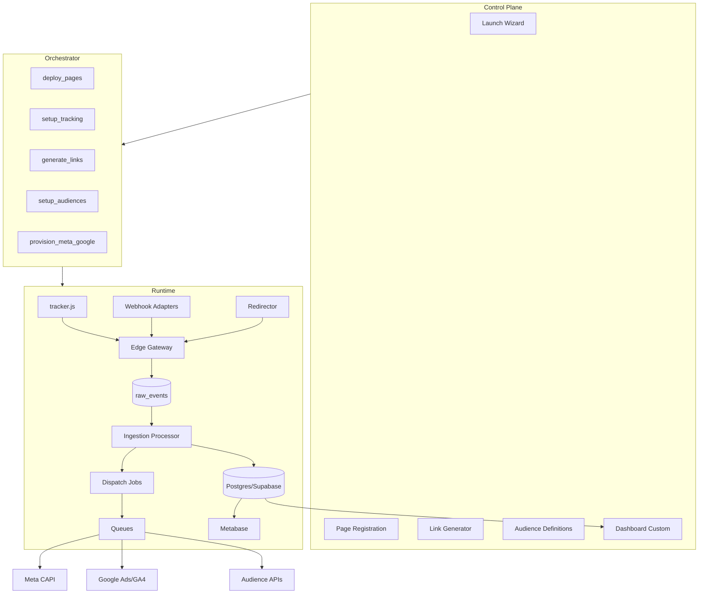
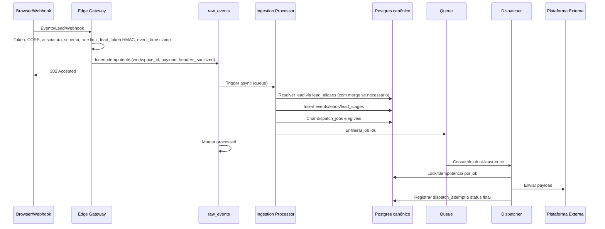

# Plataforma Interna de Lançamentos — Especificação Técnica Revisada

**Versão:** 3.0
**Autor:** Manus AI (v2.0) + revisão arquitetural incorporada (v3.0)
**Data:** 2026-05-01
**Status:** Especificação revisada para implementação
**Documento substituído:** `planejamento.md` v2.0 (e `planning.md` v1.0 indiretamente via v2.0)

> **Objetivo deste documento:** especificar, de forma completa e coerente, uma plataforma interna de tracking, atribuição, integração com Meta Ads, Google Ads, GA4, webhooks de plataformas de venda, sincronização de públicos e dashboards para lançamentos de infoprodutos. Esta versão preserva integralmente a arquitetura macro do plano original e os refinamentos da v2.0, e incorpora as conclusões da revisão arquitetural conduzida em 2026-05-01: identidade de retorno via cookie first-party assinado, merge de leads, tabelas auxiliares antes referenciadas mas não definidas, modelo "fast accept" no Edge, refinamentos de privacidade/observabilidade, e calibração explícita de escopo entre MVP e fases posteriores.

## 1. Sumário executivo

A plataforma proposta centraliza a operação técnica de lançamentos de marketing em uma base única de dados e em um runtime de tracking independente. O sistema resolve o problema recorrente de configurar manualmente tags, GTM, server-side tracking, pixels, eventos, públicos, custos, links rastreáveis e dashboards a cada lançamento. A proposta revisada mantém a arquitetura em três camadas — **Runtime**, **Orchestrator** e **Control Plane** — porque essa separação permite entregar valor real antes da construção de wizard, IA e automação completa.

A v2.0 transformou o plano original em uma especificação implementável: diferenciou IDs internos de IDs públicos, definiu contratos HTTP estáveis, introduziu modelo explícito de segurança, tratou PII e consentimento como requisitos de primeira classe, separou os fluxos Meta CAPI, GA4, Google Ads Conversion Upload, Enhanced Conversions e Customer Match/Data Manager API, e adicionou camada operacional de `dispatch_jobs` para auditoria, retry, deduplicação por destino e observabilidade.

A v3.0 incorpora quatro áreas de evolução identificadas na revisão arquitetural posterior:

1. **Identidade de retorno via cookie first-party assinado (`__ftk`).** Permite que retornantes sejam reconhecidos pelo `tracker.js` e que eventos subsequentes (InitiateCheckout, Purchase, eventos custom) cheguem a Meta CAPI e Google Ads com `user_data` enriquecido server-side a partir da `leads`, sem o browser precisar reenviar PII.
2. **Lead merge via `lead_aliases`.** Substitui as três unique constraints de `leads` (que travavam o sistema quando o mesmo indivíduo aparecia primeiro com email-only depois com phone-only) por um modelo de aliases + processo canônico de merge auditado em `lead_merges`.
3. **Tabelas auxiliares antes apenas referenciadas.** `lead_survey_responses`, `lead_icp_scores`, `webinar_attendance`, `audience_snapshots` (com membros materializados), `audit_log` e `raw_events` (modelo fast accept) ganham especificação completa.
4. **Refinamentos de privacidade, FX, observabilidade e segurança.** Retenção e erasure (SAR) explícitos, rotação de `PII_MASTER_KEY` com versionamento por registro, normalização cambial em `ad_spend_daily`, rate limit por workspace, clamp de `event_time` no Edge, e detalhes específicos de assinatura Stripe.

> **Princípio central:** o Runtime deve funcionar sozinho. LPs externas, páginas hospedadas pelo sistema e plataformas fechadas alimentam o mesmo Edge Gateway, mas o pipeline de dados, atribuição, dispatch, públicos e dashboards permanece independente da origem do evento.

## 2. Escopo, fora de escopo e premissas

A plataforma cobre ingestão de eventos de marketing, identificação de leads, atribuição first-touch e last-touch, tracking em LPs próprias ou externas, normalização de webhooks, envio server-side para plataformas de mídia, ingestão de custos, sincronização de públicos e análise de performance. O sistema também prevê, em fases posteriores, geração assistida de páginas, provisionamento de campanhas e dashboard customizado.

| Categoria | Incluído nesta especificação | Observação |
|---|---|---|
| Tracking client-side | `tracker.js`, captura de PageView, Lead, Contact, ViewContent, InitiateCheckout e eventos customizados | Funciona em páginas próprias e externas. |
| Tracking server-side | Webhooks de plataformas de venda, webinar e survey | Adapters normalizam payloads para o evento interno. |
| Meta Ads | Conversions API, Custom Audiences e deduplicação browser/server | Requer coordenação de `event_id` entre Pixel e CAPI. |
| Google Ads | GA4 Measurement Protocol, upload de conversões, Enhanced Conversions e estratégia de Customer Match/Data Manager | Cada fluxo tem contrato e pré-requisitos próprios. |
| Atribuição first/last-touch | First-touch e last-touch por `(lead_id, launch_id)` | Reconstruído no MVP a partir de attribution params persistidos client-side. |
| Identificação de retornantes via cookie assinado | Cookie first-party `__ftk` com lead_token HMAC | Entra na Fase 2. |
| Atribuição cross-session multi-touch | `visitor_id` anônimo + retroactive linking entre PageView anônimo e lead | Fase 3, fora do MVP. |
| Dashboard | Metabase no MVP; dashboard custom em fase posterior | Metabase deve consultar views/rollups. |
| Orquestração | Jobs de deploy, setup de tracking, links, públicos e campanhas | Somente após Runtime estável. |
| IA e geração de LP | Copy + LP Generator em fase posterior | Fora do MVP de tracking. |

Ficam fora do MVP: modelagem estatística de atribuição incremental, MMM, otimização automática de budget, criação autônoma irrestrita de campanhas sem aprovação humana, enriquecimento de dados por terceiros e suporte universal a qualquer plataforma de checkout sem adapter homologado.

## 3. Atores, personas e responsabilidades

O sistema possui atores humanos e sistemas externos. Cada ator interage com uma camada diferente da plataforma, e essa distinção evita que requisitos de UI contaminem requisitos do Runtime.

| Ator | Descrição | Interações principais |
|---|---|---|
| Profissional de marketing | Usuário que cria lançamentos, links, públicos e acompanha dashboards | Control Plane, Metabase, Link Generator, Page Registration. |
| Desenvolvedor/operador interno | Responsável por configurar domínio, secrets, adapters e deploys | Monorepo, Workers, Supabase, Trigger.dev (Fase 5), Cloudflare. |
| Lead | Visitante capturado pelas LPs e eventos de funil | Tracker, formulários, links, checkout e webhooks. |
| Plataforma de mídia | Meta Ads, Google Ads e GA4 | Recebem eventos, conversões, públicos e fornecem custos. |
| Plataforma fechada | Hotmart, Kiwify, Stripe, WebinarJam, Typeform, Tally | Envia webhooks normalizados pelo Edge Gateway. |
| Sistema de analytics | Metabase e dashboard custom futuro | Lê views, rollups e métricas agregadas. |
| Operador de privacidade | Responsável por SAR, erasure, retenção e auditoria | Endpoints admin e `audit_log`. |

## 4. Requisitos funcionais

Os requisitos funcionais estão organizados por domínio. Cada requisito deve ser rastreável a casos de uso e critérios de aceite no rollout.

| ID | Requisito funcional | Prioridade | Critério de aceite resumido |
|---|---|---:|---|
| RF-001 | Criar e manter workspaces multi-tenant | P0 | Cada registro operacional possui `workspace_id` e isolamento lógico. |
| RF-002 | Criar lançamentos com UUID interno e `public_id` externo | P0 | Snippets e YAML usam `public_id`; relações internas usam UUID. |
| RF-003 | Registrar páginas próprias, externas e plataformas fechadas | P0 | Cada página define `integration_mode`, domínio permitido e `page_token`. |
| RF-004 | Servir configuração pública de página de forma segura | P0 | Configuração exige token público válido e domínio permitido. |
| RF-005 | Capturar PageView e eventos configurados via `tracker.js` | P0 | Eventos chegam ao gateway, são validados e persistidos. |
| RF-006 | Capturar leads e PII com hash, criptografia e consentimento | P0 | Lead é upsertado por hash e PII não aparece em logs. |
| RF-007 | Gerar e resolver links curtos rastreáveis | P0 | Redirector registra clique e redireciona com UTMs/macro parameters. |
| RF-008 | Persistir event log imutável com `schema_version` | P0 | Cada evento válido gera registro em `events`. |
| RF-009 | Criar jobs de dispatch por destino | P0 | Cada evento elegível gera um ou mais `dispatch_jobs`. |
| RF-010 | Enviar eventos elegíveis para Meta CAPI | P0 | Jobs Meta registram status, resposta, retry e deduplicação por destino. |
| RF-011 | Suportar GA4 Measurement Protocol como fluxo separado | P1 | Eventos GA4 possuem `client_id`/`session_id` quando disponíveis. |
| RF-012 | Suportar Google Ads conversion upload quando houver click ID válido | P1 | Upload ocorre apenas com `gclid`, `gbraid` ou `wbraid` e `conversion_action` mapeado. |
| RF-013 | Suportar Enhanced Conversions quando houver tag/original conversion e `order_id` | P1 | Sistema cria adjustment job somente quando pré-requisitos forem atendidos. |
| RF-014 | Normalizar webhooks de Hotmart, Kiwify e Stripe | P0 | Purchase homologado pode ser associado a lead/atribuição. |
| RF-015 | Registrar estágios do funil com controle de duplicidade semântica | P0 | Stage único por lead/lançamento quando o estágio for não recorrente. |
| RF-016 | Ingerir custos de Meta e Google diariamente | P1 | `ad_spend_daily` inclui conta, moeda, timezone, campanha, anúncio e `granularity`. |
| RF-017 | Sincronizar públicos Meta como jobs persistidos | P1 | Cada audience possui snapshot materializado, diff, status e logs. |
| RF-018 | Suportar Google Customer Match via Data Manager API ou Google Ads API allowlisted | P1 | Upload Google é bloqueado se a conta/API não for elegível. |
| RF-019 | Criar dashboards de funil, CPL, CPA, ROAS, ICP% e atribuição | P1 | Metabase consulta views/rollups, não tabelas quentes diretamente. |
| RF-020 | Registrar survey e scoring de ICP | P2 | Respostas são associadas ao lead e geram `icp_score`. |
| RF-021 | Registrar presença em aulas/webinar | P2 | Webhook cria estágios `watched_class_n`. |
| RF-022 | Criar Control Plane para configuração sem YAML manual | P2 | Usuário registra lançamento, página, links e públicos via UI. |
| RF-023 | Orquestrar deploy de LPs e provisionamento de campanhas | P3 | Jobs só executam após aprovação humana e Runtime estável. |
| RF-024 | Emitir e validar `lead_token` assinado em cookie first-party para identificar retornantes | P0 (Fase 2) | `tracker.js` lê `__ftk` e Edge valida HMAC antes de aceitar `lead_id`. |
| RF-025 | Suportar merge de leads via `lead_aliases` quando múltiplos identificadores convergirem | P0 | Merge gera registro auditado em `lead_merges` e atualiza FKs em events/atribuição/stages. |
| RF-026 | Capturar e propagar cookies `_gcl_au` (Google) e `_ga` (GA4) além de `fbc`/`fbp` | P1 | Tracker lê esses cookies quando presentes; nunca os cria. |
| RF-027 | Clampar `event_time` no Edge quando divergir do `received_at` além da janela configurada | P0 | `if abs(event_time - received_at) > EVENT_TIME_CLAMP_WINDOW_SEC: event_time = received_at`. |
| RF-028 | Registrar audit log de mudanças em entidades de configuração | P1 | Cada UPDATE/INSERT/DELETE em `pages.event_config`, `audiences.query_definition`, `page_tokens` gera `audit_log`. |
| RF-029 | Suportar Subject Access Request (SAR) e erasure por `lead_id` | P1 | Endpoint admin dispara job que anonimiza PII e mantém agregados. |
| RF-030 | Persistir snapshots materializados de audience (membros) para cálculo de diff | P1 | Diff calculado entre `audience_snapshot_members` de snapshots T-1 e T. |

## 5. Requisitos não funcionais

Os requisitos não funcionais são tão importantes quanto os funcionais, porque tracking incorreto gera decisões erradas de mídia. O sistema deve priorizar confiabilidade, segurança, auditabilidade e privacidade antes de automações avançadas.

| ID | Requisito não funcional | Meta inicial | Observação |
|---|---|---:|---|
| RNF-001 | Latência do endpoint `/v1/events` | p95 inferior a 50 ms no Edge (modelo fast accept) | Edge insere em `raw_events` e enfileira; processor async normaliza. |
| RNF-002 | Disponibilidade do Runtime | 99,5% no MVP; evoluir para 99,9% | Runtime é mais crítico que Control Plane. |
| RNF-003 | Durabilidade dos eventos aceitos | Nenhum evento aceito deve ser perdido silenciosamente | Falhas devem ir para DLQ ou status de retry. |
| RNF-004 | Idempotência | Obrigatória em ingestão e dispatch por destino | Cloudflare Queues tem entrega at-least-once; duplicatas podem ocorrer.[^5] |
| RNF-005 | Segurança | Todos os endpoints públicos têm token, rate limit, validação e CORS restrito | Webhooks exigem assinatura quando a plataforma suportar. |
| RNF-006 | Privacidade | PII não pode aparecer em logs, payloads sanitizados ou dashboards analíticos | Nome também é PII. |
| RNF-007 | Observabilidade | Métricas por rota, fila, destino, erro, retry e DLQ | Obrigatória antes de produção real. |
| RNF-008 | Escalabilidade analítica | Tabelas quentes não devem ser fonte direta de dashboards pesados | Usar views materializadas/rollups. |
| RNF-009 | Evolutividade | Eventos possuem `schema_version` e contratos versionados | Alterações breaking exigem nova versão; additive mantêm versão. |
| RNF-010 | Manutenibilidade | TypeScript estrito, Zod em fronteiras, testes e migrations versionadas | Sem `any` salvo exceção justificada. |
| RNF-011 | Rate limit por workspace | Cota global por tenant em camadas (ingestão/dispatch/audience) | Configurável por tier; previne workspace problemático esgotar quotas globais Meta/Google. |
| RNF-012 | Rotação de `PII_MASTER_KEY` | Sem downtime; lazy re-encryption on read + batch background opcional | `pii_key_version` por registro permite múltiplas versões coexistindo. |
| RNF-013 | Retenção explícita por tabela e categoria de dado | events brutos 13m; dispatch_attempts 90d; logs 30d; PII enc até erasure | Política aplicada por job de purge incremental. |

## 6. Arquitetura lógica em camadas

A arquitetura permanece organizada em três camadas verticais. A camada Runtime é a única necessária para gerar valor inicial. O Orchestrator e o Control Plane são aceleradores de operação, não dependências para tracking.



A separação entre ingestão e dispatch é obrigatória. O Edge Gateway valida, normaliza minimamente e persiste em `raw_events`, retornando 202 rapidamente. Um Ingestion Processor async lê `raw_events`, normaliza para `events`/`leads`/`lead_stages` e cria `dispatch_jobs`. O envio a plataformas externas ocorre por jobs idempotentes e auditáveis. Essa decisão reduz perda silenciosa, atende RNF-001 (p95 < 50ms no Edge), permite reprocessamento controlado e transforma cada integração externa em um destino observável.

### 6.1 Mapa de responsabilidades

A separação entre os subsistemas define onde cada peça roda e qual tecnologia usar. Esta tabela é canônica — qualquer dúvida operacional sobre "isso é fila ou cron" se resolve aqui.

| Subsistema | Modo de execução | Tecnologia | Fase |
|---|---|---|---|
| Ingestão `/v1/*` | sync (request-response) | Cloudflare Worker (Hono) | 1 |
| Ingestion processor (raw → normalized) | async | CF Queue consumer | 1 |
| Dispatch jobs (Meta/Google/GA4) | async | CF Queue consumer | 2 |
| Cost ingestor | scheduled diário | CF Cron Trigger | 3 |
| Audience sync (eval + diff + dispatch) | scheduled + queue | CF Cron + CF Queue | 3 |
| Orchestrator (provisioning de campanhas, deploy de LPs) | workflows com aprovação humana | Trigger.dev | 5 |

Trigger.dev fica fora do MVP. CF Queues + CF Cron cobrem todas as necessidades de Fases 1–4.

## 7. Modos de integração

A plataforma aceita três modos de integração por página ou etapa do funil. Um lançamento pode combinar os três modos, desde que todos alimentem o mesmo modelo de identidade, eventos e atribuição.

| Modo | Nome | Controle sobre a página | Entrada principal | Uso típico |
|---|---|---:|---|---|
| A | LP do sistema | Alto | `tracker.js` injetado automaticamente | Páginas geradas pelo Astro/Cloudflare Pages. |
| B | LP externa com snippet | Médio | Snippet público + config remota | WordPress, Webflow, Hostinger, Framer ou página de terceiro. |
| C | Plataforma fechada | Baixo | Webhook assinado | Hotmart, Kiwify, Stripe Checkout, WebinarJam, Typeform. |

No Modo B, o snippet usa apenas identificadores públicos e token de página. O UUID interno nunca deve aparecer no HTML público.

```html
<script
  src="https://cdn.seudominio.com/tracker.js"
  data-site-token="pk_live_7f1c..."
  data-launch-public-id="lcm-marco-2026"
  data-page-public-id="captura-v3"
  async>
</script>
```

No Modo C, webhooks devem tentar associar eventos por ordem de prioridade: `lead_id`, `external_id`, `order_id`, `email_hash`, `email`, `phone`, `fbclid/gclid` propagados, e por último heurísticas controladas por janela temporal. Heurísticas nunca devem sobrescrever uma associação forte.

## 8. Identidade pública, tokens e configuração

A versão revisada separa identidade interna de identidade pública. IDs internos são UUIDs usados em joins, segurança e integridade. IDs públicos são slugs ou chaves legíveis, usadas em snippets, YAML, URLs e configurações humanas.

| Entidade | ID interno | ID público | Regra de unicidade |
|---|---|---|---|
| Workspace | `workspaces.id uuid` | `workspaces.slug` | Global. |
| Launch | `launches.id uuid` | `launches.public_id` | Único por workspace. |
| Page | `pages.id uuid` | `pages.public_id` | Único por launch. |
| Link | `links.id uuid` | `links.slug` | Global no domínio de redirect. |
| Audience | `audiences.id uuid` | `audiences.public_id` | Único por workspace. |
| Page Token | `page_tokens.id uuid` | `token_hash` | Token em claro só no momento da emissão. |
| Lead Token | n/a (HMAC stateless) ou `lead_tokens.id uuid` se stateful | claim assinado contendo `(workspace_id, lead_id, page_token_hash, exp)` | Validado por assinatura; revogação opcional via `lead_tokens.revoked_at`. |

A configuração pública deve ser recuperada com token e IDs públicos. O endpoint não deve aceitar apenas `launch_public_id` e `page_public_id` sem token, pois IDs legíveis podem ser enumerados.

```text
GET /v1/config/:launch_public_id/:page_public_id
Headers:
  X-Funil-Site: pk_live_...
```

O servidor valida o token, confirma que ele pertence à página solicitada, valida domínio permitido via `Origin`/`Referer` quando disponível, aplica rate limit e só então retorna `event_config` sanitizado.

### 8.1 Rotação de `page_token`

O `page_token` está embutido em HTML público de LPs externas, possivelmente em propriedade de terceiros (WordPress, Webflow). Rotação imediata quebraria todos os snippets em produção. A política é:

- Cada `page_token` tem `status`, `created_at`, `rotated_at`, `revoked_at`.
- Ao rotacionar, um novo token é criado em `active`; o antigo passa para `rotating` por janela configurável (default 14 dias).
- Tokens em `rotating` ainda são aceitos pelo Edge, mas geram métrica `legacy_token_in_use` para alertar quem ainda não atualizou snippet.
- Após a janela, token vai para `revoked` e deixa de ser aceito.
- Revogação imediata (incidente de segurança) bypassa a janela e marca diretamente como `revoked`.

## 9. Modelo de segurança do Edge Gateway

O Edge Gateway é uma superfície pública e deve ser tratado como ambiente hostil. Segurança não é uma camada posterior; é requisito de Fase 1 e Fase 2.

| Controle | Aplicação | Detalhe obrigatório |
|---|---|---|
| Token público por página | `/v1/config`, `/v1/events`, `/v1/lead` | Token armazenado como hash; rotação com janela de overlap (8.1). |
| Lead token assinado | `/v1/events` quando `lead_id` presente | HMAC validado antes de aceitar `lead_id`; binding ao `page_token_hash` previne uso cross-page. |
| CORS restrito | Endpoints de browser | Permitir apenas domínios registrados para a página. |
| Rate limit por token, IP e rota | Todas rotas de browser | Limites diferentes para PageView, Lead e Config. |
| Rate limit por workspace | Todas rotas | Quota global por tenant; previne tenant problemático esgotar quotas Meta/Google. |
| Validação Zod | Todas as fronteiras HTTP | Rejeitar campos desconhecidos quando o contrato exigir. |
| Payload limit | Todas as rotas | Impedir abuso e payloads acidentalmente grandes. |
| Replay protection com TTL explícito | `/v1/events`, `/v1/lead` | `event_id` com janela de 7 dias (alinhado com janela CAPI); purge incremental. |
| Webhook signature | Webhooks de plataformas | Usar raw body quando a plataforma exigir. |
| Logs sanitizados | Todas as rotas | Proibido logar email, telefone, nome, IP bruto e payload completo sensível. |
| Bot/spam mitigation mínima | `/v1/lead` | Honeypot + tempo mínimo entre load/submit + Turnstile opcional + rate limit. |
| Clamp de `event_time` | `/v1/events`, `/v1/lead` | Se `abs(event_time - received_at) > EVENT_TIME_CLAMP_WINDOW_SEC`, aplicar `event_time = received_at` e logar métrica `event_time_clamps`. |

O token público não é segredo absoluto, pois estará no HTML da página, mas serve como identificador escopado, limitável e rotacionável. Operações administrativas nunca usam token público; elas exigem autenticação do Control Plane ou credencial server-side.

### 9.1 Stripe webhook signature

Webhooks Stripe usam esquema próprio: header `Stripe-Signature` carrega timestamp + assinatura HMAC sobre `${timestamp}.${raw_body}` com secret específico por endpoint. O adapter Stripe **deve**:

1. Usar `stripe.webhooks.constructEvent(rawBody, signatureHeader, endpointSecret)` (ou implementação equivalente que respeite raw body).
2. Aplicar tolerância de 5 minutos sobre o timestamp para anti-replay (Stripe envia eventos relativamente recentes; janelas maiores aumentam superfície de replay).
3. Comparar assinaturas em tempo constante (`crypto.timingSafeEqual`), nunca com `===` ou `==`.
4. Rejeitar `400 invalid_signature` sem revelar detalhes do erro ao caller.

Implementação string-equal naive abre o adapter a timing attacks. Esta seção deixa explícito porque é o tipo de detalhe que costuma ser silenciosamente errado.

## 10. Privacidade, PII, consentimento e retenção

A plataforma deve tratar dados pessoais por minimização, finalidade e rastreabilidade de consentimento. Email, telefone e nome são PII. IP, user agent, referrer e payloads livres podem conter dados pessoais ou identificadores indiretos. Por isso, o sistema distingue quatro categorias de dados.

| Categoria | Exemplo | Armazenamento | Uso permitido |
|---|---|---|---|
| Identificadores hashados | `email_hash`, `phone_hash`, `external_id_hash` | SHA-256 após normalização | Matching, dedup, analytics sem PII. |
| PII criptografada | `email_enc`, `phone_enc`, `name_enc` | AES-256-GCM com chave por workspace | Exibição autorizada e suporte operacional. |
| Dados transitórios | IP bruto, user agent completo | Usar no request/dispatch e descartar ou armazenar minimizado | Meta CAPI e diagnóstico estritamente necessário. |
| Dados analíticos | canal, campanha, stage, score | Sem PII direta | Dashboard, cohort, funil e atribuição. |

A Meta CAPI possui requisitos específicos: parâmetros de contato como email e telefone devem ser normalizados e hashados, enquanto `client_ip_address` e `client_user_agent` não devem ser hashados; para eventos de website enviados via Conversions API, `client_user_agent` é requerido.[^2] Portanto, a especificação não deve armazenar IP bruto como regra geral, mas deve permitir uso transitório controlado para compor o payload Meta no momento do dispatch.

O sistema deve registrar consentimento por finalidade. No mínimo, cada lead/evento deve poder indicar consentimento para `analytics`, `marketing`, `ad_user_data`, `ad_personalization` e `customer_match`. Ausência de consentimento deve bloquear destinos que exigem consentimento explícito, especialmente uploads de públicos.

| Finalidade | Campo sugerido | Impacto quando negado |
|---|---|---|
| Analytics | `consent_analytics` | Evento pode ser descartado ou agregado anonimamente, conforme política do workspace. Cookies `__fvid` e `__ftk` não são setados. |
| Marketing direto | `consent_marketing` | Bloqueia uso em campanhas próprias e CRM. |
| Dados para anúncios | `consent_ad_user_data` | Bloqueia upload de dados do usuário quando exigido pela plataforma. |
| Personalização de anúncios | `consent_ad_personalization` | Bloqueia inclusão em públicos de remarketing/personalização. |
| Customer Match | `consent_customer_match` | Bloqueia sincronização em listas Meta/Google. |

### 10.1 Retenção e erasure (SAR/GDPR Art. 17, LGPD)

| Categoria de dado | Retenção padrão | Reset por consentimento? |
|---|---:|---|
| `events` brutos (incluindo `request_context`) | 13 meses | Não — anonimizado no SAR. |
| `dispatch_attempts` (request/response sanitizados) | 90 dias | Sim — purge automático. |
| Logs estruturados | 30 dias | Sim. |
| `raw_events` (após processamento) | 7 dias | Sim. |
| PII criptografada (`*_enc`) | Indeterminado até erasure ou inatividade > 36 meses | Sim — anonimizado por job. |
| `lead_consents` | Permanente (prova de consentimento) | Não — necessário para auditoria. |
| `audit_log` | 7 anos | Não. |

O sistema expõe endpoint admin `DELETE /v1/admin/leads/:lead_id` (Seção 12.6) que dispara job de anonimização:

1. Marca `leads.status = 'erased'`.
2. Zera `email_enc`, `phone_enc`, `name_enc`, `email_hash`, `phone_hash`, `external_id_hash`.
3. Percorre `events` do lead e zera campos PII em `user_data` jsonb (mantém `event_name`, `event_time`, atribuição agregada).
4. Zera `events.request_context.ip_hash`, `request_context.ua_hash` se presentes.
5. Anonimiza `lead_attribution` (mantém atribuição agregada para preservar análise histórica).
6. Remove rows em `lead_aliases` correspondentes.
7. Mantém `lead_stages` e métricas agregadas.
8. Registra ação em `audit_log` com `action = 'erase_sar'`.

### 10.2 Cookies e consentimento

O tracker maneja cinco cookies first-party (próprios e capturados):

| Cookie | Origem | Propósito | TTL | Requer consent |
|---|---|---|---:|---|
| `__fvid` | Próprio (tracker gera) | Identificador anônimo de visitor para multi-touch (Fase 3) | 1 ano | `consent_analytics = granted` |
| `__ftk` | Próprio (backend setta via Set-Cookie em `/v1/lead`) | Lead token assinado para reidentificação em retornos | 30–90 dias (configurável) | `consent_analytics = granted` |
| `_gcl_au` | Google Ads (capturado, não criado) | Identificador Google Ads para remarketing/conversion | gerenciado pelo Google | Aplicação Google Consent Mode |
| `_ga` | GA4 (capturado, não criado) | `client_id` GA4 | gerenciado pelo GA4 | idem |
| `fbp`/`fbc` | Meta Pixel (capturado, não criado) | Identificadores Meta para CAPI | gerenciado pelo Meta | aplicado nas regras de consentimento Meta |

Configurações dos cookies próprios:
- `SameSite=Lax`, `Secure`, `Path=/`.
- `HttpOnly=false` (tracker precisa ler `__ftk` no client para anexar a eventos subsequentes — trade-off explícito; ver mitigação em Seção 29).
- Domínio: o domínio efetivo da página, não o domínio do Edge Gateway.

### 10.3 Rotação de `PII_MASTER_KEY`

A política de rotação evita downtime e re-encryption batch obrigatória:

- Cada registro com PII enc carrega `pii_key_version smallint` indicando qual versão da chave foi usada.
- `PII_MASTER_KEY_V{n}` é versionado em secret manager; novas escritas usam sempre a versão corrente (`PII_KEY_VERSION` atual).
- Leitura: dispatcher/admin lê `pii_key_version` do registro e usa a chave correspondente; chaves antigas são mantidas até ser confirmado que nenhum registro depende delas.
- Re-encryption: opcional, lazy on read (re-encrypta quando o registro é tocado em update) ou batch background job sem urgência.
- Derivação por workspace: `workspace_key = HKDF(PII_MASTER_KEY_V{n}, salt=workspace_id, info="pii")`. Comprometer a chave de um workspace não compromete os demais.

## 11. Modelo de dados revisado

O schema abaixo é uma especificação lógica. A implementação em Drizzle deve gerar migrations SQL versionadas, com índices e constraints explícitos.

### 11.1 Entidades de configuração

```sql
workspaces (
  id uuid primary key,
  slug text not null unique,
  name text not null,
  status text not null default 'active',
  fx_normalization_currency text not null default 'BRL',
  created_at timestamptz not null,
  updated_at timestamptz not null
);

launches (
  id uuid primary key,
  workspace_id uuid not null references workspaces(id),
  public_id text not null,
  name text not null,
  status text not null, -- draft, configuring, live, ended, archived
  timezone text not null default 'America/Sao_Paulo',
  config jsonb not null default '{}',
  created_at timestamptz not null,
  updated_at timestamptz not null,
  unique (workspace_id, public_id)
);

pages (
  id uuid primary key,
  workspace_id uuid not null references workspaces(id),
  launch_id uuid not null references launches(id),
  public_id text not null,
  role text not null, -- capture, sales, thankyou, webinar, checkout, survey
  integration_mode text not null, -- a_system, b_snippet, c_webhook
  url text,
  allowed_domains text[] not null default '{}',
  event_config jsonb not null default '{}',
  variant text,
  status text not null default 'active',
  created_at timestamptz not null,
  updated_at timestamptz not null,
  unique (launch_id, public_id)
);

page_tokens (
  id uuid primary key,
  workspace_id uuid not null references workspaces(id),
  page_id uuid not null references pages(id),
  token_hash text not null unique,
  label text,
  status text not null default 'active', -- active, rotating, revoked
  created_at timestamptz not null,
  rotated_at timestamptz,
  revoked_at timestamptz
);
```

### 11.2 Identidade, leads e consentimento

```sql
leads (
  id uuid primary key,
  workspace_id uuid not null references workspaces(id),
  external_id_hash text,
  email_hash text,
  email_enc text,
  phone_hash text,
  phone_enc text,
  name_hash text,
  name_enc text,
  pii_key_version smallint not null default 1,
  status text not null default 'active', -- active, merged, erased
  merged_into_lead_id uuid references leads(id),
  first_seen_at timestamptz not null,
  last_seen_at timestamptz not null,
  created_at timestamptz not null,
  updated_at timestamptz not null
);
-- ATENÇÃO: NÃO usar unique sobre email_hash/phone_hash/external_id_hash.
-- Unicidade migra para lead_aliases (Seção 11.6) para suportar merge.

lead_consents (
  id uuid primary key,
  workspace_id uuid not null references workspaces(id),
  lead_id uuid references leads(id),
  event_id text,
  consent_analytics text not null, -- granted, denied, unknown
  consent_marketing text not null,
  consent_ad_user_data text not null,
  consent_ad_personalization text not null,
  consent_customer_match text not null,
  source text not null,
  policy_version text,
  ts timestamptz not null
);
```

### 11.3 Atribuição, links e cliques

```sql
links (
  id uuid primary key,
  workspace_id uuid not null references workspaces(id),
  launch_id uuid not null references launches(id),
  slug text not null unique,
  destination_url text not null,
  channel text not null,
  campaign text,
  ad_account_id text,
  campaign_id text,
  adset_id text,
  ad_id text,
  creative_id text,
  placement text,
  utm_source text,
  utm_medium text,
  utm_campaign text,
  utm_content text,
  utm_term text,
  status text not null default 'active',
  created_at timestamptz not null
);

link_clicks (
  id uuid primary key,
  workspace_id uuid not null references workspaces(id),
  launch_id uuid not null references launches(id),
  link_id uuid references links(id),
  slug text not null,
  ts timestamptz not null,
  ip_hash text,
  ua_hash text,
  referrer_domain text,
  fbclid text,
  gclid text,
  gbraid text,
  wbraid text,
  fbc text,
  fbp text,
  attribution jsonb not null default '{}'
);

lead_attribution (
  id uuid primary key,
  workspace_id uuid not null references workspaces(id),
  launch_id uuid not null references launches(id),
  lead_id uuid not null references leads(id),
  touch_type text not null, -- first, last, all
  source text,
  medium text,
  campaign text,
  content text,
  term text,
  link_id uuid references links(id),
  ad_account_id text,
  campaign_id text,
  adset_id text,
  ad_id text,
  creative_id text,
  fbclid text,
  gclid text,
  gbraid text,
  wbraid text,
  fbc text,
  fbp text,
  ts timestamptz not null
);
```

A atribuição first-touch é por `(lead_id, launch_id)` — um lead que reaparece em um lançamento subsequente recebe novo first-touch para esse lançamento. Last-touch é atualizado a cada conversão de lead dentro do lançamento.

### 11.4 Eventos, estágios e dispatch

```sql
events (
  id uuid primary key,
  workspace_id uuid not null references workspaces(id),
  launch_id uuid references launches(id),
  page_id uuid references pages(id),
  lead_id uuid references leads(id),
  visitor_id text, -- nullable; populado em Fase 3 com __fvid; reservado em Fases 1-2
  event_id text not null,
  event_name text not null,
  event_source text not null, -- tracker, webhook:hotmart, redirector, system
  schema_version integer not null,
  event_time timestamptz not null, -- pode ser clampado pelo Edge (RF-027)
  received_at timestamptz not null,
  attribution jsonb not null default '{}',
  user_data jsonb not null default '{}', -- somente hash/ids permitidos; chaves padronizadas: client_id_ga4, session_id_ga4, fbc, fbp, _gcl_au
  custom_data jsonb not null default '{}',
  consent_snapshot jsonb not null default '{}',
  request_context jsonb not null default '{}', -- sanitizado
  processing_status text not null default 'accepted',
  unique (workspace_id, event_id)
);

lead_stages (
  id uuid primary key,
  workspace_id uuid not null references workspaces(id),
  launch_id uuid not null references launches(id),
  lead_id uuid not null references leads(id),
  stage text not null,
  source_event_id uuid references events(id),
  ts timestamptz not null,
  is_recurring boolean not null default false
);

-- Constraint parcial recomendada em SQL nativo:
-- unique (workspace_id, launch_id, lead_id, stage) where is_recurring = false

dispatch_jobs (
  id uuid primary key,
  workspace_id uuid not null references workspaces(id),
  event_id uuid not null references events(id),
  destination text not null, -- meta_capi, ga4_mp, google_ads_conversion, google_enhancement
  destination_account_id text,
  destination_resource_id text,
  destination_subresource text, -- pixel_id (meta), conversion_action (google), measurement_id (ga4), audience_id (customer match)
  idempotency_key text not null unique,
  status text not null, -- pending, processing, succeeded, retrying, failed, skipped, dead_letter
  eligibility_reason text,
  skip_reason text,
  attempt_count integer not null default 0,
  max_attempts integer not null default 5,
  next_attempt_at timestamptz,
  created_at timestamptz not null,
  updated_at timestamptz not null
);

dispatch_attempts (
  id uuid primary key,
  workspace_id uuid not null references workspaces(id),
  dispatch_job_id uuid not null references dispatch_jobs(id),
  attempt_number integer not null,
  status text not null,
  request_payload_sanitized jsonb,
  response_payload_sanitized jsonb,
  response_status integer,
  error_code text,
  error_message text,
  started_at timestamptz not null,
  finished_at timestamptz
);
```

A chave de idempotência é canonizada como:

```
idempotency_key = sha256(workspace_id|event_id|destination|destination_resource_id|destination_subresource)
```

Onde `destination_subresource` = `pixel_id` para Meta, `conversion_action` para Google Ads conversion upload, `measurement_id` para GA4 MP, `audience_id` para Customer Match. Isso impede duplicidade por retry e permite enviar o mesmo evento a múltiplos destinos com rastreabilidade independente.

### 11.5 Custos, públicos e analytics

```sql
ad_spend_daily (
  id uuid primary key,
  workspace_id uuid not null references workspaces(id),
  launch_id uuid references launches(id),
  platform text not null, -- meta, google
  account_id text not null,
  campaign_id text,
  adset_id text,
  ad_id text,
  granularity text not null check (granularity in ('account','campaign','adset','ad')),
  date date not null,
  timezone text not null,
  currency text not null,
  spend_cents integer not null,
  spend_cents_normalized integer, -- em workspace.fx_normalization_currency
  fx_rate numeric(18,8),
  fx_source text, -- ecb, wise, manual, ...
  fx_currency text, -- moeda alvo da normalização
  impressions integer,
  clicks integer,
  fetched_at timestamptz not null,
  source_payload_hash text,
  unique (workspace_id, platform, account_id,
          coalesce(campaign_id,''), coalesce(adset_id,''), coalesce(ad_id,''),
          granularity, date)
);

audiences (
  id uuid primary key,
  workspace_id uuid not null references workspaces(id),
  public_id text not null,
  name text not null,
  platform text not null, -- meta, google
  destination_strategy text not null, -- meta_custom_audience, google_data_manager, google_ads_api_allowlisted
  query_definition jsonb not null,
  consent_policy jsonb not null,
  status text not null,
  created_at timestamptz not null,
  updated_at timestamptz not null,
  unique (workspace_id, public_id)
);

audience_sync_jobs (
  id uuid primary key,
  workspace_id uuid not null references workspaces(id),
  audience_id uuid not null references audiences(id),
  snapshot_id uuid references audience_snapshots(id),
  prev_snapshot_id uuid references audience_snapshots(id),
  status text not null,
  planned_additions integer not null default 0,
  planned_removals integer not null default 0,
  sent_additions integer not null default 0,
  sent_removals integer not null default 0,
  platform_job_id text,
  error_code text,
  error_message text,
  started_at timestamptz,
  finished_at timestamptz,
  next_attempt_at timestamptz
);
```

`timezone` deixa de ser parte da unique key porque não é parte da identidade do gasto — é metadata. O unique usa `granularity` + `coalesce` em campos opcionais para evitar bug de NULL-distinct em Postgres.

### 11.6 Identidade estendida e merge

Substitui as três unique constraints originais de `leads` por modelo de aliases que suporta merge canônico.

```sql
lead_aliases (
  id uuid primary key,
  workspace_id uuid not null references workspaces(id),
  identifier_type text not null, -- email_hash, phone_hash, external_id_hash, lead_token_id
  identifier_hash text not null,
  lead_id uuid not null references leads(id),
  source text not null, -- form_submit, webhook:hotmart, manual, merge
  status text not null default 'active', -- active, superseded, revoked
  ts timestamptz not null
);
-- índice (não unique) em (workspace_id, identifier_type, identifier_hash)
-- unique parcial: unique (workspace_id, identifier_type, identifier_hash)
--                where status = 'active'

lead_merges (
  id uuid primary key,
  workspace_id uuid not null references workspaces(id),
  canonical_lead_id uuid not null references leads(id),
  merged_lead_id uuid not null references leads(id),
  reason text not null, -- email_phone_convergence, manual, sar
  performed_by text, -- system, admin user id
  before_summary jsonb,
  after_summary jsonb,
  merged_at timestamptz not null
);

lead_tokens (
  id uuid primary key,
  workspace_id uuid not null references workspaces(id),
  lead_id uuid not null references leads(id),
  token_hash text not null unique,
  page_token_hash text not null,
  issued_at timestamptz not null,
  expires_at timestamptz not null,
  revoked_at timestamptz,
  last_used_at timestamptz
);
-- Tabela só necessária se lead_token for stateful (com revogação).
-- Se lead_token for HMAC stateless puro, a tabela é dispensável e revogação se dá via rotação de LEAD_TOKEN_HMAC_SECRET.
```

**Algoritmo de resolução com merge:**

1. Lead chega com identificadores I1, I2, I3.
2. Sistema busca em `lead_aliases` ativos: `SELECT lead_id FROM lead_aliases WHERE workspace_id = $w AND status = 'active' AND (identifier_type, identifier_hash) IN (...)`.
3. Casos:
   - **0 leads encontrados** → criar novo `lead`, inserir aliases para I1/I2/I3, status active.
   - **1 lead encontrado** → atualizar atributos do lead existente, inserir aliases novos.
   - **N > 1 leads encontrados** → executar merge: escolher canonical (lead mais antigo por `first_seen_at`); para cada lead não-canônico, atualizar FKs em `events.lead_id`, `lead_attribution.lead_id`, `lead_stages.lead_id`, `lead_consents.lead_id`, `lead_survey_responses.lead_id`, `lead_icp_scores.lead_id`; marcar lead não-canônico com `status='merged'`, `merged_into_lead_id=canonical`; mover `lead_aliases` para canonical e marcar antigos como `superseded`; inserir registro em `lead_merges`.

### 11.7 Survey, ICP e webinar

```sql
lead_survey_responses (
  id uuid primary key,
  workspace_id uuid not null references workspaces(id),
  lead_id uuid not null references leads(id),
  launch_id uuid references launches(id),
  survey_id text not null,
  survey_version text,
  response jsonb not null,
  ts timestamptz not null
);

lead_icp_scores (
  id uuid primary key,
  workspace_id uuid not null references workspaces(id),
  lead_id uuid not null references leads(id),
  launch_id uuid references launches(id),
  score_version text not null, -- versionamento de regras
  score_value numeric not null,
  is_icp boolean not null,
  inputs jsonb not null,
  evaluated_at timestamptz not null
);

webinar_attendance (
  id uuid primary key,
  workspace_id uuid not null references workspaces(id),
  lead_id uuid not null references leads(id),
  launch_id uuid not null references launches(id),
  session_id text not null,
  joined_at timestamptz not null,
  left_at timestamptz,
  watched_seconds integer,
  max_watch_marker text, -- e.g. "75%", "completed"
  source text not null, -- webhook:webinarjam, webhook:zoom, manual
  unique (workspace_id, lead_id, session_id)
);
```

### 11.8 Audience snapshots

```sql
audience_snapshots (
  id uuid primary key,
  workspace_id uuid not null references workspaces(id),
  audience_id uuid not null references audiences(id),
  snapshot_hash text not null,
  generated_at timestamptz not null,
  member_count integer not null,
  retention_status text not null default 'active' -- active, archived, purged
);

audience_snapshot_members (
  snapshot_id uuid not null references audience_snapshots(id),
  lead_id uuid not null references leads(id),
  primary key (snapshot_id, lead_id)
);
-- particionar por snapshot_id se volume crescer.
-- retenção: manter os últimos 2 snapshots por audience; demais purged.
```

Diff entre snapshots T-1 e T calcula `planned_additions = members(T) - members(T-1)` e `planned_removals = members(T-1) - members(T)`, alimentando `audience_sync_jobs`.

### 11.9 Audit log e raw_events

```sql
audit_log (
  id uuid primary key,
  workspace_id uuid not null references workspaces(id),
  actor_id text, -- user uuid or system actor
  actor_type text not null, -- user, system, api_key
  action text not null, -- create, update, delete, rotate, revoke, erase_sar, merge_leads
  entity_type text not null, -- page, page_token, audience, lead, launch
  entity_id text not null,
  before jsonb,
  after jsonb,
  ts timestamptz not null,
  request_context jsonb -- sanitized
);

raw_events (
  id uuid primary key,
  workspace_id uuid not null references workspaces(id),
  page_id uuid references pages(id),
  payload jsonb not null,
  headers_sanitized jsonb,
  received_at timestamptz not null,
  processed_at timestamptz,
  processing_status text not null default 'pending', -- pending, processed, failed, discarded
  processing_error text
);
-- retenção: 7 dias após processed_at; purge automático.
```

`raw_events` é a entrada do modelo "fast accept": Edge insere e retorna 202 em ms; ingestion processor async normaliza para `events`/`leads`/`lead_stages` e cria `dispatch_jobs`.

## 12. Contratos HTTP públicos e internos

Todos os contratos públicos são versionados sob `/v1`. Mudanças incompatíveis exigem `/v2` ou feature flag por página/workspace. Mudanças additive (novos campos opcionais) mantêm `schema_version` e são tratadas com Zod `.passthrough()` controlado.

### 12.1 `GET /v1/config/:launch_public_id/:page_public_id`

Este endpoint retorna configuração pública sanitizada para o tracker. Ele exige `X-Funil-Site`, valida domínio e nunca retorna segredos, IDs internos desnecessários ou dados de outras páginas.

| Item | Especificação |
|---|---|
| Auth | `X-Funil-Site: pk_live_...` obrigatório. |
| Rate limit | Baixo/médio por token e IP, pois pode ser cacheado. |
| Cache | KV 60 segundos; `ETag` recomendado. |
| Resposta | `event_config`, flags de pixel/browser integration, endpoints e schema version. |
| Erros | `401 invalid_token`, `403 origin_not_allowed`, `404 page_not_found`, `429 rate_limited`. |
| Rotação de token | Tokens em status `rotating` são aceitos por janela de overlap (Seção 8.1). |

### 12.2 `POST /v1/events`

Este endpoint recebe eventos genéricos do tracker. Ele deve ser rápido, idempotente e restritivo. No modelo fast accept, persiste em `raw_events` e retorna 202 imediatamente.

```json
{
  "event_id": "evt_01h...",
  "schema_version": 1,
  "launch_public_id": "lcm-marco-2026",
  "page_public_id": "captura-v3",
  "event_name": "PageView",
  "event_time": "2026-03-15T20:01:10-03:00",
  "lead_token": "optional-signed-token-from-cookie-__ftk",
  "lead_id": "optional-public-lead-id (somente se lead_token ausente em fluxo administrativo)",
  "visitor_id": "optional-fvid-from-cookie-__fvid",
  "attribution": {
    "utm_source": "meta",
    "utm_medium": "paid",
    "utm_campaign": "lcm_marco_2026",
    "fbclid": "...",
    "gclid": "...",
    "fbc": "...",
    "fbp": "...",
    "_gcl_au": "...",
    "_ga": "..."
  },
  "custom_data": {
    "value": 29700,
    "currency": "BRL",
    "order_id": "optional"
  },
  "consent": {
    "analytics": "granted",
    "ad_user_data": "granted",
    "ad_personalization": "granted"
  }
}
```

**Regras adicionais:**

- `lead_token` e `lead_id` são mutuamente exclusivos em payloads originados do browser. Browser **deve** usar `lead_token`. `lead_id` em claro só é aceito em fluxos administrativos server-to-server autenticados.
- Edge valida `lead_token` HMAC antes de aceitar. Falha de validação não derruba o evento, mas remove o `lead_id` resolvido (evento é aceito como anônimo) e registra métrica `lead_token_validation_failures`.
- Edge aplica clamp de `event_time` quando `abs(event_time - received_at) > EVENT_TIME_CLAMP_WINDOW_SEC` (default 300s) e registra métrica `event_time_clamps`.
- Resposta padrão: `202 Accepted` com `{ "event_id": "...", "status": "accepted" }`. Quando o mesmo `event_id` já tiver sido aceito (idempotência), resposta é `{ "status": "duplicate_accepted" }`, sem criar novo evento nem novos dispatch jobs.

### 12.3 `POST /v1/lead`

Este endpoint identifica ou cria lead, registra consentimento, atualiza atribuição, gera evento `Lead` e **emite `lead_token` assinado**, setando cookie `__ftk` na resposta. Compartilha os mesmos controles de token, CORS, rate limit e replay protection de `/v1/events`.

| Campo | Obrigatório | Regra |
|---|---:|---|
| `event_id` | Sim | Único por workspace. |
| `launch_public_id` | Sim | Validado contra token. |
| `page_public_id` | Sim | Validado contra token. |
| `email` ou `phone` | Sim | Normalizar, hash e criptografar. |
| `name` | Não | Criptografar; nunca armazenar em claro. |
| `attribution` | Não | Usar para first/last-touch. Inclui UTMs, click IDs e cookies de plataforma capturados. |
| `consent` | Sim no modo produção | Ausência vira `unknown`, não `granted`. |

**Resposta:**

```json
{
  "status": "accepted",
  "lead_public_id": "lead_01h...",
  "lead_token": "v1.eyJhbG...",
  "expires_at": "2026-07-14T20:01:10Z"
}
```

Edge também envia `Set-Cookie`:
```
Set-Cookie: __ftk=v1.eyJhbG...; Path=/; SameSite=Lax; Secure; Max-Age=5184000
```

`HttpOnly` **não** é setado porque o `tracker.js` precisa ler o cookie para anexá-lo a eventos subsequentes. O trade-off (XSS em LP externa pode ler `__ftk`) é mitigado por:
- TTL relativamente curto (default 60 dias).
- Binding do token ao `page_token_hash` da página onde foi emitido (token roubado não funciona em outra página).
- Possibilidade de revogação ativa via `lead_tokens.revoked_at`.

### 12.4 `GET /r/:slug`

O redirector resolve links curtos e registra clique assíncrono. Ele não deve bloquear o usuário caso o log falhe, mas a falha precisa ser observável.

O destino recebe UTMs e parâmetros de identidade propagáveis, respeitando segurança e privacidade. O sistema deve evitar anexar PII em query string. Para checkout, a preferência é propagar `lead_id` público, `external_id` ou `order_context_id`, nunca email em claro. Quando disponível, `__fvid` pode ser propagado para correlação posterior em fluxos cross-domain (ex.: LP → checkout em domínio terceiro).

### 12.5 `POST /v1/webhook/:platform`

Cada adapter valida assinatura, normaliza payload nativo e cria eventos internos. Webhooks sem assinatura suportada pela plataforma devem exigir token de webhook dedicado e IP allowlist quando possível.

**Regra de idempotência de retry da plataforma:** o `event_id` interno é derivado deterministicamente de:

```
event_id = sha256(platform || ':' || platform_event_id)[:32]
```

Isso garante que retries da plataforma (Hotmart, Stripe, Kiwify reenviam o mesmo evento se não receberem 2xx) não criam duplicatas, porque o constraint `unique (workspace_id, event_id)` em `events` rejeita o segundo insert e o adapter retorna idempotente.

| Plataforma | Fase | Eventos mínimos | Associação recomendada |
|---|---:|---|---|
| Hotmart | 2 | `Purchase`, `InitiateCheckout`, refund futuro | `order_id`, email, phone, query params propagados. |
| Kiwify | 2 | `Purchase`, `InitiateCheckout` | `order_id`, email, phone. |
| Stripe | 2 | `checkout.session.completed`, payment events | `client_reference_id`, metadata, customer email. Validação por `constructEvent` com tolerância 5min (Seção 9.1). |
| WebinarJam | 3 | presença, duração, aula | `lead_id`, email. |
| Typeform/Tally | 3 | survey completed | `lead_id`, hidden fields. |

### 12.6 `DELETE /v1/admin/leads/:lead_id` (SAR/Erasure)

Endpoint admin (autenticação Control Plane) que dispara job de anonimização conforme política de retenção (Seção 10.1). Síncrono retorna `202 Accepted` com `{ "job_id": "...", "status": "queued" }`; o job é executado por worker async e seu progresso é observável via `audit_log` com `action = 'erase_sar'`.

| Item | Especificação |
|---|---|
| Auth | Control Plane session ou API key admin com escopo `pii:erase`. |
| Rate limit | Restritivo. |
| Resposta | `202 Accepted` com `job_id`. |
| Pós-execução | `leads.status = 'erased'`, PII zerada, `lead_aliases` removidos, `audit_log` registrado. |
| Reversibilidade | Não. Usuário deve confirmar com double-confirm na UI. |

### 12.7 Identidade do tracker em runtime

A sequência de identidade no browser, considerando cookies e tokens:

```
1. Visitor anônimo chega na LP:
   - tracker.js carrega config via /v1/config.
   - lê cookies: __fvid (gera se ausente, com consent), __ftk (lê se existir).
   - se __ftk presente, todos os eventos subsequentes carregam lead_token.
   - se __ftk ausente, eventos são anônimos (somente attribution params).

2. Visitor preenche form e submete:
   - tracker.js POST /v1/lead com consent + attribution + form data.
   - backend cria/atualiza lead, emite lead_token, retorna no body + Set-Cookie __ftk.
   - tracker.js passa a anexar lead_token aos próximos eventos.

3. Lead retorna em sessão futura:
   - tracker.js carrega, lê __ftk do cookie, anexa a todos os eventos.
   - InitiateCheckout/Purchase chegam ao Edge com lead_token válido.
   - Edge valida HMAC, resolve lead_id, persiste em events.
   - Dispatcher Meta CAPI lookup leads por lead_id, enriquece user_data com em/ph/fbc/fbp.

4. Logout/Erasure/Revogação:
   - tracker.js expõe Funil.logout() que zera __ftk no client.
   - SAR no backend revoga lead_tokens via lead_tokens.revoked_at.
```

## 13. Tracker.js

O `tracker.js` deve ser pequeno, sem dependências externas, compatível com páginas simples e resiliente a falhas. Seu papel é coletar eventos, persistir atribuição first-party e enviar payloads válidos ao Edge Gateway.

### 13.1 Inicialização

Ao carregar, o tracker lê `data-site-token`, `data-launch-public-id` e `data-page-public-id`, busca a configuração pública, captura UTMs, `fbclid`, `gclid`, `gbraid`, `wbraid`, `fbc`, `fbp`, `_gcl_au`, `_ga`, referrer sanitizado e IDs first-party. Depois, dispara `PageView` se configurado.

```js
window.Funil.track('Lead', {
  email,
  phone,
  name,
  consent: {
    analytics: 'granted',
    ad_user_data: 'granted',
    ad_personalization: 'granted',
    customer_match: 'granted'
  }
});

window.Funil.track('Contact', { channel: 'whatsapp' });
window.Funil.track('InitiateCheckout', { value: 29700, currency: 'BRL' });
window.Funil.track('Purchase', { value: 29700, currency: 'BRL', order_id: 'ord_123' });
window.Funil.identify({ lead_token: 'v1...' }); // não mais lead_id em claro
window.Funil.decorate('a.cta-checkout');
window.Funil.page();
window.Funil.logout(); // zera __ftk localmente
```

### 13.2 Integração com Meta Pixel no browser

A configuração da página deve declarar uma política de Pixel: `server_only`, `browser_and_server_managed` ou `coexist_with_existing_pixel`. Quando houver envio browser + server para o mesmo Pixel, o tracker deve garantir que o mesmo `event_id` seja usado como `eventID` no Pixel e `event_id` na CAPI. A Meta recomenda deduplicação por correspondência entre `eventID`/`event_id` e nome do evento dentro da janela aplicável.[^1]

| Política | Uso | Requisito |
|---|---|---|
| `server_only` | LP sem Pixel browser | Não há dedup browser/server, apenas envio CAPI. |
| `browser_and_server_managed` | Tracker controla Pixel e CAPI | Tracker injeta/dispara Pixel com `eventID` compartilhado. |
| `coexist_with_existing_pixel` | LP já tem Pixel próprio | Usuário deve mapear forma de compartilhar `event_id`; caso contrário, CAPI para eventos duplicáveis deve ser desabilitada ou marcada como risco. |

### 13.3 Cookies do tracker

| Cookie | Origem | Propósito | TTL |
|---|---|---|---:|
| `__fvid` | Tracker gera (UUID v4) na primeira visita com consent_analytics | Identificador anônimo de visitor (Fase 3 — multi-touch). Reservado em Fases 1-2 mas não usado para attribution. | 1 ano |
| `__ftk` | Backend setta via `Set-Cookie` em `/v1/lead` | Lead token assinado para reidentificação em retornos | configurável (default 60 dias) |
| `_gcl_au`, `_ga`, `fbc`, `fbp` | Meta/Google (cookies de plataforma) | Capturados quando presentes; tracker **lê e propaga**, nunca cria | gerenciado pelas plataformas |

Adicionalmente, o tracker mantém em `localStorage` os attribution params da sessão atual (UTMs, `gclid`, `fbclid`, `gbraid`, `wbraid`, `referrer_domain`) para serem replayados no payload de `/v1/lead`. Isso permite reconstruir first-touch no momento do cadastro **sem depender de `visitor_id`** — o que é coerente com a decisão de adiar `visitor_id` para Fase 3.

### 13.4 Reidentificação em retornos

Sequência detalhada do cenário "lead retorna após dias e dispara InitiateCheckout":

1. `tracker.js` carrega na página; lê cookie `__ftk`.
2. Cookie presente e válido (TTL não expirado): tracker armazena `lead_token` em estado in-memory.
3. Usuário clica em CTA "Comprar agora" → tracker dispara `InitiateCheckout`.
4. Payload de `/v1/events` carrega `lead_token` (não `lead_id` em claro).
5. Edge valida HMAC do `lead_token` com `LEAD_TOKEN_HMAC_SECRET`, confere `page_token_hash` do claim contra `page_token` corrente, valida `exp`.
6. Edge insere em `raw_events` com `lead_token` no payload; ingestion processor normaliza `events` com `lead_id` resolvido a partir do claim.
7. Dispatcher Meta CAPI consome o evento, faz `SELECT email_hash, phone_hash, ... FROM leads WHERE id = $lead_id`, monta payload CAPI com `user_data` = `{ em: email_hash, ph: phone_hash, fbc, fbp, _gcl_au, client_ip_address: <transient>, client_user_agent: <transient> }`.
8. Dispatcher Google (Conversion Upload) só dispara se houver `gclid` armazenado no lead (em `lead_attribution`) ou propagado no evento atual; senão registra job como `skipped` com `skip_reason='no_click_id_available'`.
9. CAPI/Google retornam; `dispatch_attempts` registra resultado.

**Cross-domain (LP em domínio A → checkout em domínio B):** cookies não funcionam. Esse caso cai no fluxo de webhook association da Seção 17 (propagar `lead_public_id` ou `order_context_id` em query string ao decorar links de checkout).

## 14. Pipeline de ingestão, deduplicação e dispatch

O pipeline revisado tem seis etapas: validação, fast accept (raw_events), normalização async, persistência canônica, criação de jobs e processamento assíncrono. O Edge Gateway não deve chamar Meta ou Google diretamente durante o request do browser, e também não deve fazer múltiplos writes serializados a Postgres durante o request.



Como filas podem entregar uma mensagem mais de uma vez, consumidores devem buscar o `dispatch_job`, adquirir lock transacional ou marcação atômica, verificar status e somente então chamar a plataforma externa.[^5]

**Validações realizadas síncronamente no Edge antes do 202:**

1. Token público (X-Funil-Site) válido e ativo (ou em `rotating`).
2. CORS / Origin permitido para a página.
3. Rate limit por token, IP e workspace.
4. Zod schema do payload.
5. Replay protection: `event_id` consultado em cache distribuído (KV ou Redis); se já visto nos últimos 7 dias, retorna idempotente sem inserir.
6. `lead_token` HMAC quando presente; falha não derruba evento, apenas remove `lead_id` resolvido.
7. Clamp de `event_time`.
8. Webhook signature (Stripe constructEvent, Hotmart HMAC, Kiwify HMAC).

**Trabalho assíncrono no Ingestion Processor:**

1. Resolução de lead via `lead_aliases` com merge se necessário (Seção 11.6).
2. Criação/atualização de `lead_attribution` (first/last-touch).
3. Criação de `lead_stages` (com unique parcial).
4. Inserção em `events`.
5. Criação de `dispatch_jobs` por destino elegível.
6. Decisões de eligibility (consent, user_data mínimo, conta configurada).

## 15. Meta Conversions API

Meta CAPI é um destino de dispatch por evento. O envio depende de elegibilidade, consentimento, configuração de Pixel e disponibilidade mínima de `user_data`. O payload deve usar dados hashados quando exigido e dados não hashados quando a documentação exigir que não sejam hashados, como IP e user agent.[^2]

| Campo interno | Campo Meta | Regra |
|---|---|---|
| `event_name` | `event_name` | Deve corresponder ao Pixel browser se houver dedup. |
| `event_time` | `event_time` | Unix timestamp; pode ter sido clampado pelo Edge. |
| `event_id` | `event_id` | Mesmo valor do `eventID` browser quando aplicável. |
| `email_hash` | `em` | Normalizado e SHA-256. Lookup em `leads` quando `event.lead_id` presente. |
| `phone_hash` | `ph` | Normalizado e SHA-256. Lookup em `leads`. |
| `client_ip_address` transitório | `client_ip_address` | Não hashado, não persistido em claro por padrão.[^2] |
| `client_user_agent` transitório | `client_user_agent` | Requerido para eventos de website via CAPI.[^2] |
| `fbc`/`fbp` | `fbc`/`fbp` | Não hashados. Capturados de cookie ou de attribution. |
| `value`, `currency`, `order_id` | `custom_data` | Para Purchase e eventos monetários. |

**Regra de enriquecimento server-side:** quando `event.lead_id` está presente (resolvido via `lead_token` ou via webhook association), o dispatcher faz `SELECT email_hash, phone_hash, fbp, fbc FROM leads JOIN lead_attribution ... WHERE leads.id = $lead_id` e popula `user_data` mesmo quando o evento original (ex.: InitiateCheckout disparado em retorno) não trouxe PII no payload do browser. Isso vale para qualquer evento — PageView, Lead, Contact, InitiateCheckout, Purchase, custom.

**PageView sem PII:** PageView pode ser dispatchado para Meta CAPI **sem** `em`/`ph`, apenas com `fbc`/`fbp`/`client_ip_address`/`client_user_agent`. Isso é suficiente para alimentar Custom Audiences de remarketing, que é o caso de uso primário do PageView. Esse fluxo **não depende** de `lead_id`, `lead_token`, ou `visitor_id`.

`idempotency_key` para Meta: `sha256(workspace_id|event_id|meta_capi|account_id|pixel_id)`.

O sistema deve registrar resposta da Meta em `dispatch_attempts`, incluindo erros de validação, rate limit e qualidade de match quando disponível. Eventos sem consentimento adequado ou sem user data suficiente devem ser marcados como `skipped` com `skip_reason` explícito.

## 16. Google Ads, GA4 e Enhanced Conversions

Google Ads não deve ser tratado como um único dispatcher genérico. A especificação separa quatro fluxos, cada um com pré-requisitos próprios.

| Fluxo | Destino | Pré-requisitos mínimos | Status no MVP |
|---|---|---|---:|
| GA4 Measurement Protocol | GA4 | `measurement_id`, `api_secret`, `client_id` e/ou `session_id` quando disponíveis | P1 |
| Google Ads Conversion Upload | Google Ads API | `conversion_action`, timestamp, valor, moeda e `gclid`/`gbraid`/`wbraid` válido | P1 |
| Enhanced Conversions for Web | Google Ads API adjustment | Conversão original tagueada com click ID e `order_id`; upload posterior de dados hashados em até 24 horas | P1/P2 |
| Customer Match | Data Manager API ou Google Ads API allowlisted | Elegibilidade, consentimento e política de upload | P1/P2 |

A documentação do Google Ads API para Enhanced Conversions informa que uma tag deve enviar um identificador de clique, como GCLID, e um `order_id` no momento da conversão; depois, a API pode enviar dados first-party hashados associados a esse `order_id`.[^3] Portanto, o sistema não deve prometer Enhanced Conversions quando a página/checkout não gera `order_id` consistente ou quando não existe conversão original tagueada.

Para Customer Match, novos adotantes via Google Ads API podem não ser aceitos desde 1º de abril de 2026, e a recomendação oficial passou a ser Data Manager API para novos fluxos; tokens não allowlisted podem receber erro `CUSTOMER_NOT_ALLOWLISTED_FOR_THIS_FEATURE`.[^4][^6] Assim, a estratégia Google para públicos deve ser condicional.

| Estratégia Google Audience | Quando usar | Comportamento do sistema |
|---|---|---|
| `google_data_manager` | Novo adotante ou estratégia padrão | Usa Data Manager API quando disponível e configurada. |
| `google_ads_api_allowlisted` | Token já elegível/allowlisted | Usa Customer Match via Google Ads API com checks de elegibilidade. |
| `disabled_not_eligible` | Sem consentimento, sem elegibilidade ou sem API configurada | Marca audience como não sincronizável e explica motivo. |

### 16.1 Estratégia de `client_id` GA4

Cenários:

1. **LP com GA4 client-side ativo:** tracker lê cookie `_ga`, extrai `client_id` (formato `GA1.X.YYYYYYYY.ZZZZZZZZZZ`) e propaga.
2. **LP sem GA4 client-side:** sistema mintera `client_id` próprio derivado de `__fvid` (formato compatível com GA4: `GA1.1.<8digits>.<10digits-timestamp>`) e persiste no localStorage para coerência cross-page. Trade-off: relatórios GA4 server-side ficam descolados de qualquer GA4 web property pré-existente. Documentar esse trade-off ao operador no Control Plane.

`_gcl_au` é capturado em paralelo e propagado quando GCLID está indisponível (ex.: usuário entrou via redirect interno mas Google Ads tag setou `_gcl_au` em visita anterior).

`idempotency_key` para GA4: `sha256(workspace_id|event_id|ga4_mp|measurement_id)`.
`idempotency_key` para Google Ads conversion: `sha256(workspace_id|event_id|google_ads_conversion|customer_id|conversion_action)`.

## 17. Webhook adapters e propagação de identidade

Adapters convertem payloads nativos em eventos internos. Cada adapter deve ter testes com fixtures reais ou representativos, validação de assinatura e tabela de mapeamento de status.

**Regra de derivação de `event_id` interno** (Seção 12.5): `event_id = sha256(platform || ':' || platform_event_id)[:32]`. Garante idempotência contra retries da plataforma usando o constraint `unique (workspace_id, event_id)` em `events`.

O ponto crítico é a propagação de identidade. O tracker deve decorar links de checkout e webinar com parâmetros seguros, como `lead_public_id`, `launch_public_id`, `order_context_id`, UTMs e click IDs. Plataformas que aceitam metadata devem receber `lead_public_id` e `order_context_id`. Plataformas que aceitam apenas URL devem receber parâmetros em query string sem PII.

| Prioridade de associação | Identificador | Confiabilidade |
|---:|---|---:|
| 1 | `lead_public_id` propagado ou `external_id_hash` | Alta |
| 2 | `order_id` ou `client_reference_id` previamente criado | Alta |
| 3 | Email/telefone do webhook normalizados e hashados (consultados via `lead_aliases`) | Média/alta |
| 4 | `gclid`, `fbclid`, `fbc`, `fbp` propagados | Média |
| 5 | Janela temporal + campanha + valor | Baixa; usar apenas como sugestão, não associação automática forte |

**Cross-domain identity:** quando a LP está em domínio A e checkout em domínio B (Hotmart, Stripe Checkout), cookies `__ftk`/`__fvid` não atravessam. A propagação obrigatória vai via:

```
https://pay.hotmart.com/...?lead_public_id=lead_01h...&order_context_id=oc_xyz&launch_public_id=lcm-marco-2026&utm_source=meta&utm_campaign=...
```

O `lead_public_id` é seguro de expor (não-PII; UUID v4 não-guessable). PII em URL **nunca**.

## 18. Sistema de atribuição

A atribuição do MVP é dual: first-touch e last-touch. O first-touch representa a primeira origem conhecida do lead no workspace/lançamento. O last-touch representa a origem imediatamente anterior à conversão de lead. O sistema também preserva eventos e cliques para análises futuras de multi-touch.

| Modelo | Uso | Regra |
|---|---|---|
| First-touch | Origem inicial de aquisição | Criado uma vez por `(lead_id, launch_id)`. Um lead que reaparece em outro lançamento recebe novo first-touch para esse lançamento. |
| Last-touch | Conversão de lead | Atualizado no momento do cadastro ou evento principal. |
| All-touch | Auditoria e evolução futura | Guardado como eventos e atribuições adicionais. |

**Nota crítica sobre first-touch no MVP:** sem `visitor_id` (adiado para Fase 3), o sistema não consegue ligar PageViews anônimos prévios a um lead que se cadastra depois. A reconstituição de first-touch no MVP usa **attribution params persistidos client-side em localStorage pelo tracker** (UTMs, click IDs, cookies de plataforma), replayados no payload de `/v1/lead`. Isso é suficiente para "qual campanha trouxe esse lead" mas insuficiente para "esse lead viu 3 páginas em 2 sessões antes de converter" — esse caso vem com Fase 3.

CPL e CPA por anúncio devem ser calculados com cuidado. Nem sempre `ad_id` de uma URL, de um relatório Meta, de um relatório Google e de uma macro dinâmica representam o mesmo nível de entidade. O sistema deve armazenar `platform`, `account_id`, `campaign_id`, `adset_id`, `ad_id`, `creative_id` e `placement` separadamente, e usar `granularity` em `ad_spend_daily` para join correto.

## 19. Audience sync

Audience sync não é apenas um cron que calcula diff. É um subsistema com estado, consentimento, elegibilidade, snapshots materializados e jobs persistidos.

Cada audience possui uma `query_definition` segura. O Control Plane pode oferecer um builder visual; queries SQL livres só devem ser permitidas a administradores técnicos ou convertidas em DSL validada. O resultado da audience deve ser materializado como **snapshot com membros** em `audience_snapshots` + `audience_snapshot_members` antes do envio.

| Etapa | Descrição | Falha tratável |
|---|---|---|
| Avaliar query | Calcula candidatos elegíveis | Query inválida, timeout, volume alto. |
| Aplicar consentimento | Remove leads sem consentimento exigido | Consentimento ausente/negado. |
| Gerar snapshot | Insert em `audience_snapshots` + `audience_snapshot_members`; calcula `snapshot_hash` | Mudança de query ou dados. |
| Calcular diff | `members(T)` SET-DIFF `members(T-1)` | Estado anterior ausente → tudo é addition. |
| Criar sync job | Persiste operações planejadas em `audience_sync_jobs` com `snapshot_id`/`prev_snapshot_id` | Concorrência por audience. |
| Enviar para plataforma | Batch conforme limites | Rate limit, erro de API, conta inelegível. |
| Registrar resultado | Match rate/status quando disponível | Erros parciais e retry. |

Para Google Customer Match, jobs simultâneos sobre a mesma lista devem ser evitados, e consentimento precisa ser tratado explicitamente conforme documentação.[^4] O sistema deve bloquear concorrência por `audience_id + platform_resource_id` via lock pessimista (advisory lock no Postgres ou Redis lock).

**Retenção de snapshots:** manter os últimos 2 snapshots `active` por audience; demais marcados `archived` e purgados após 30 dias.

## 20. Cost ingestor

O cost ingestor roda diariamente por plataforma e conta. Ele deve gravar dados com moeda, timezone, nível de granularidade, normalização cambial e `fetched_at`. O sistema não deve assumir que todos os custos chegam no mesmo fuso ou que todos os relatórios são finais no primeiro fetch.

| Campo | Motivo |
|---|---|
| `workspace_id` | Multi-tenant e isolamento. |
| `launch_id` | Relatório por lançamento quando houver mapeamento. |
| `platform` e `account_id` | Contas múltiplas por workspace. |
| `granularity` | Nível do registro (`account`/`campaign`/`adset`/`ad`). Evita NULL-distinct bug em unique key. |
| `currency` | Moeda original da conta. |
| `spend_cents_normalized`, `fx_rate`, `fx_source`, `fx_currency` | Conversão para moeda de relatório do workspace. |
| `timezone` | Coerência com data de campanha e funil. |
| `fetched_at` | Auditoria e reprocessamento. |
| `source_payload_hash` | Detectar mudança de dados retroativos. |

### 20.1 Estratégia de FX

- `workspaces.fx_normalization_currency` define a moeda alvo (default BRL, configurável).
- `FX_RATES_PROVIDER` define a fonte (`ecb`, `wise`, `manual`).
- Cost ingestor consulta taxa diária na data do gasto e grava `fx_rate` + `fx_source`.
- `spend_cents_normalized = round(spend_cents * fx_rate)`.
- Reprocessamento retroativo: quando a fonte revisa taxa antiga (raro mas acontece), job opcional re-normaliza últimos 30 dias.
- Dashboards de ROAS sempre usam `spend_cents_normalized` para consistência cross-currency.

## 21. Survey, webinar e ICP scoring

Survey e webinar entram pelo mesmo pipeline de webhooks, mas seus eventos têm semântica própria. As tabelas concretas estão em Seção 11.7.

- Survey atualiza `lead_survey_responses` e pode gerar `lead_icp_scores`.
- Webinar cria registros em `webinar_attendance` e estágios `watched_class_n` em `lead_stages`.

O scoring de ICP deve começar como regras configuráveis por workspace, com versionamento (`score_version`). Cada score precisa registrar `score_version`, campos avaliados (`inputs jsonb`) e resultado. Modelos estatísticos ou IA podem ser adicionados depois, mas não devem ser requisito do MVP.

## 22. Analytics, Metabase e rollups

O Metabase no MVP é mantido, mas deve consultar views e tabelas agregadas. O event log bruto serve para auditoria, debugging e reprocessamento, não como fonte primária de dashboards pesados.

| Camada analítica | Fonte | Uso |
|---|---|---|
| `events` bruto | Tabela particionada por tempo | Auditoria e investigação. |
| `fact_funnel_events` | View normalizada | Base de funil. |
| `daily_funnel_rollup` | Agregado diário | Dashboard executivo. |
| `ad_performance_rollup` | Join controlado de custo + atribuição (usa `spend_cents_normalized`) | CPL, CPA, ROAS por origem. |
| `audience_health_view` | Audience jobs e match status | Monitorar sync de públicos. |
| `dispatch_health_view` | Dispatch jobs/attempts | Operação técnica. |
| `audit_log_view` | `audit_log` filtrado | Auditoria de mudanças no Control Plane. |

Métricas mínimas do MVP incluem visitas, leads, contatos, checkout, compras, taxa entre etapas, CPL, CPA, receita, ROAS, ICP%, custo por ICP, conversão por canal/campanha/anúncio e falhas de tracking por destino.

## 23. Observabilidade, DLQ e auditoria

A observabilidade deve cobrir negócio e operação. Um dashboard de negócio sem dashboard técnico é insuficiente para tracking.

| Métrica operacional | Dimensões | Ação esperada |
|---|---|---|
| Eventos recebidos | workspace, launch, page, event_name | Detectar quedas de tracking. |
| Eventos rejeitados | motivo, rota, token | Corrigir configuração ou bloquear abuso. |
| Dispatch succeeded/failed | destino, conta, evento | Diagnosticar integração. |
| Latência ingestão → dispatch | destino, fila | Ajustar filas e retries. |
| DLQ size | fila, destino | Reprocessar ou corrigir bug. |
| Duplicatas bloqueadas | event_id, destino | Validar idempotência. |
| Webhook signature failures | plataforma | Detectar spoofing ou configuração errada. |
| Audience sync failures | platform, audience | Corrigir consentimento, elegibilidade ou API. |
| `lead_token_validation_failures` | rota, motivo (expired/invalid_signature/page_token_mismatch) | Detectar tampering ou rotação não comunicada. |
| `event_time_clamps` | rota, magnitude do offset | Detectar relógios cliente errados sistematicamente. |
| `lead_merges_executed` | razão | Auditoria de merges automáticos. |
| `pii_re_encryption_progress` | versão antiga, versão nova | Acompanhar rotação de chave. |
| `audience_snapshot_diff_size` | audience, additions, removals | Detectar mudanças anômalas em audiences. |
| `legacy_token_in_use` | page, token age | Acompanhar adoção de novos page_tokens após rotação. |

Retries devem usar backoff exponencial com jitter. Erros 4xx permanentes devem virar `failed` ou `skipped`, não retry infinito. Erros 429 e 5xx devem ir para `retrying` até `max_attempts`. Após limite, o job vai para `dead_letter` com payload sanitizado suficiente para diagnóstico.

## 24. Estrutura do monorepo

A estrutura original é mantida com ajustes para refletir segurança, jobs, contratos compartilhados e novos componentes (lead_token, cookies, raw_events processor).

```text
funil/
├── apps/
│   ├── edge/
│   │   ├── src/
│   │   │   ├── index.ts
│   │   │   ├── middleware/
│   │   │   │   ├── auth-public-token.ts
│   │   │   │   ├── cors.ts
│   │   │   │   ├── rate-limit.ts
│   │   │   │   └── sanitize-logs.ts
│   │   │   ├── routes/
│   │   │   │   ├── config.ts
│   │   │   │   ├── events.ts
│   │   │   │   ├── lead.ts
│   │   │   │   ├── redirect.ts
│   │   │   │   ├── admin/
│   │   │   │   │   └── leads-erase.ts
│   │   │   │   └── webhooks/
│   │   │   ├── dispatchers/
│   │   │   │   ├── meta-capi.ts
│   │   │   │   ├── ga4-mp.ts
│   │   │   │   ├── google-conversion-upload.ts
│   │   │   │   ├── google-enhanced-conversions.ts
│   │   │   │   └── audience-sync.ts
│   │   │   ├── lib/
│   │   │   │   ├── attribution.ts
│   │   │   │   ├── consent.ts
│   │   │   │   ├── cookies.ts
│   │   │   │   ├── dedup.ts
│   │   │   │   ├── event-time-clamp.ts
│   │   │   │   ├── idempotency.ts
│   │   │   │   ├── lead-resolver.ts
│   │   │   │   ├── lead-token.ts
│   │   │   │   ├── pii.ts
│   │   │   │   ├── queue.ts
│   │   │   │   ├── raw-events-processor.ts
│   │   │   │   └── security.ts
│   │   │   └── crons/
│   │   └── wrangler.toml
│   ├── tracker/
│   ├── control-plane/
│   ├── orchestrator/
│   └── lp-templates/
├── packages/
│   ├── shared/
│   │   └── src/
│   │       ├── contracts/
│   │       │   ├── events.ts
│   │       │   ├── lead.ts
│   │       │   ├── lead-token.ts
│   │       │   └── webhooks/
│   │       ├── consent.ts
│   │       ├── attribution.ts
│   │       └── launch.ts
│   └── db/
│       ├── migrations/
│       ├── schema.ts
│       └── views.sql
├── docs/
│   ├── adr/
│   ├── api/
│   └── runbooks/
└── README.md
```

## 25. Convenções de código e qualidade

O código deve ser escrito em TypeScript estrito, com schemas Zod em todas as fronteiras HTTP, webhooks, filas e JSON columns. Erros esperados devem ser modelados como valores, enquanto exceções devem representar falhas inesperadas. Logs devem ser JSON estruturado e sanitizados.

| Área | Convenção |
|---|---|
| TypeScript | `strict: true`, `noUncheckedIndexedAccess: true`. |
| Validação | Zod compartilhado em `packages/shared`. |
| Testes | Vitest para unidade; Miniflare para integração de Worker; fixtures de webhooks. |
| Migrations | SQL versionado, revisado e reversível quando possível. |
| Commits | Conventional Commits em inglês. |
| Código | Nomes em inglês; UI/copy em português. |
| Comentários | Explicar o porquê, não o óbvio. |
| Logs | Proibido PII; payload completo só sanitizado. |

## 26. Variáveis de ambiente e segredos

Segredos de plataforma devem ser por ambiente e, quando aplicável, por workspace/conta. Tokens de usuário, refresh tokens e chaves de API devem ser armazenados criptografados ou no secret manager adequado.

```text
# Supabase / DB
SUPABASE_URL=
SUPABASE_SERVICE_ROLE_KEY=
HYPERDRIVE_BINDING=

# PII
PII_MASTER_KEY_V1=
PII_KEY_VERSION=1

# Lead token (HMAC)
LEAD_TOKEN_HMAC_SECRET=
LEAD_TOKEN_DEFAULT_TTL_DAYS=60

# Edge runtime
EVENT_TIME_CLAMP_WINDOW_SEC=300
REPLAY_PROTECTION_TTL_DAYS=7
PAGE_TOKEN_ROTATION_OVERLAP_DAYS=14

# FX / Cost ingestor
WORKSPACE_FX_DEFAULT_CURRENCY=BRL
FX_RATES_PROVIDER=ecb
FX_RATES_API_KEY=

# Cloudflare
R2_TRACKER_BUCKET=
QUEUE_RAW_EVENTS=
QUEUE_DISPATCH=
QUEUE_DLQ=
KV_CONFIG_CACHE=
KV_RATE_LIMIT=
KV_REPLAY_PROTECTION=

# Meta
META_APP_ID=
META_APP_SECRET=
META_DEFAULT_PIXEL_ID=
META_CAPI_TOKEN=

# Google
GOOGLE_ADS_DEVELOPER_TOKEN=
GOOGLE_ADS_CLIENT_ID=
GOOGLE_ADS_CLIENT_SECRET=
GOOGLE_ADS_REFRESH_TOKEN=
GA4_MEASUREMENT_ID=
GA4_API_SECRET=
GOOGLE_DATA_MANAGER_CONFIG=

# Webhooks
HOTMART_WEBHOOK_SECRET=
KIWIFY_WEBHOOK_SECRET=
STRIPE_WEBHOOK_SECRET=
WEBINARJAM_WEBHOOK_SECRET=
TYPEFORM_WEBHOOK_SECRET=

# Bot mitigation (opcional)
TURNSTILE_SITE_KEY=
TURNSTILE_SECRET=
```

## 27. Casos de uso, caminhos felizes e caminhos críticos

### UC-001 — Registrar LP externa e instalar tracking

O profissional registra um lançamento e uma página externa no Control Plane. O sistema cria `launch.public_id`, `page.public_id`, `page_token`, domínios permitidos e `event_config`. O usuário copia o snippet e instala na LP. Ao carregar a página, o tracker busca configuração, dispara PageView e passa a capturar form submit.

| Caminho feliz | Caminho crítico |
|---|---|
| Token válido, domínio permitido, config encontrada e evento persistido. | Token inválido retorna 401; domínio não permitido retorna 403; selector quebrado gera erro observável sem quebrar página. |

### UC-002 — Capturar lead e atribuir origem

O lead acessa um link curto de campanha, é redirecionado com UTMs e click IDs, preenche formulário na LP e envia dados com consentimento. O sistema cria ou atualiza lead via `lead_aliases`, registra first-touch/last-touch, grava stage `registered`, cria evento `Lead`, emite `lead_token` e setta cookie `__ftk`, e gera jobs elegíveis para Meta/Google/GA4.

| Caminho feliz | Caminho crítico |
|---|---|
| Lead criado, PII hash/enc, atribuição persistida, dispatch jobs criados, `__ftk` setado. | Email ausente e telefone ausente rejeitam lead; consentimento negado bloqueia destinos de ads; duplicata retorna idempotente; merge se identificadores convergirem. |

### UC-003 — Enviar Lead para Meta CAPI com deduplicação

O tracker gera `event_id` único. Se a política da página for `browser_and_server_managed`, o mesmo ID é usado no Pixel browser e no job Meta CAPI. O dispatcher monta payload com `event_name`, `event_id`, hashes (lookup em `leads`), `fbc`, `fbp`, IP/UA transitórios quando disponíveis e registra a resposta.

| Caminho feliz | Caminho crítico |
|---|---|
| Meta aceita o evento e job vira `succeeded`. | Sem consentimento ou sem user data suficiente vira `skipped`; erro 429 vira retry; erro 400 permanente vira failed. |

### UC-004 — Registrar Purchase via webhook

A plataforma de checkout envia webhook assinado. O adapter valida assinatura (Stripe via `constructEvent` com tolerância 5min), normaliza payload, deriva `event_id = sha256(platform:platform_event_id)`, associa ao lead por `client_reference_id`, `lead_public_id`, `order_id` ou email hashado (consultado via `lead_aliases`), cria evento `Purchase`, atualiza stage `purchased` e dispara jobs elegíveis.

| Caminho feliz | Caminho crítico |
|---|---|
| Compra associada ao lead e receita entra no dashboard. | Assinatura inválida retorna 403; associação fraca fica em fila de revisão ou evento sem lead; webhook duplicado é idempotente via `unique(workspace_id, event_id)`. |

### UC-005 — Sincronizar público de leads ICP

O cron seleciona uma audience ativa, avalia query, aplica consentimento, gera `audience_snapshot` + members, calcula diff contra snapshot anterior, e cria `audience_sync_job`. O dispatcher envia batch para Meta ou Google conforme estratégia configurada.

| Caminho feliz | Caminho crítico |
|---|---|
| Snapshot novo gera additions/removals e status sincronizado. | Sem elegibilidade Google bloqueia job; consentimento ausente remove lead do envio; job simultâneo é bloqueado por lock por `audience_id`. |

### UC-006 — Dashboard de performance

O Metabase lê views e rollups para apresentar funil, CPL, CPA, ROAS, ICP% e falhas operacionais. Consultas pesadas são executadas sobre agregados, não sobre `events` bruto. ROAS usa `spend_cents_normalized` para consistência cross-currency.

| Caminho feliz | Caminho crítico |
|---|---|
| Métricas aparecem por lançamento, canal, campanha e anúncio. | Rollup atrasado exibe aviso de freshness; falha de cost ingestor aparece em dashboard técnico. |

### UC-007 — Lead retornante dispara InitiateCheckout (NOVO em v3.0)

Lead se cadastrou em T0 e recebeu cookie `__ftk`. Em T+5 dias, retorna à mesma LP, clica em CTA "Comprar agora". Tracker lê `__ftk`, anexa `lead_token` ao evento `InitiateCheckout`, envia para `/v1/events`. Edge valida HMAC, ingestion processor resolve `lead_id`, dispatcher Meta CAPI lookup em `leads`, monta `user_data` enriquecido e envia.

| Caminho feliz | Caminho crítico |
|---|---|
| `__ftk` válido, lead resolvido, CAPI recebe evento com `em`/`ph`/`fbc`/`fbp` mesmo sem o browser ter reenviado PII. | `__ftk` expirado: evento aceito como anônimo; `__ftk` com page_token_hash mismatch (LP rotacionou): tracker pede re-identificação; `__ftk` revogado (admin): tratado como anônimo. |

### UC-008 — Merge de leads convergentes (NOVO em v3.0)

Lead A foi criado em T0 com email-only. Lead B foi criado em T+2 com phone-only (mesma pessoa, outro device, sem cookie cross-device). Em T+5, pessoa preenche form com email **e** phone. Sistema busca em `lead_aliases`: encontra Lead A por email, Lead B por phone. Executa merge: canonical = Lead A (mais antigo), atualiza FKs em events/lead_attribution/lead_stages, marca Lead B como `merged`, registra em `lead_merges`, move aliases.

| Caminho feliz | Caminho crítico |
|---|---|
| Merge auditado, todas referências apontam para canonical. | Conflito de status (Lead B já merged em outro): bloquear cadeia de merge e flagar para revisão manual; rollback manual via `lead_merges`. |

### UC-009 — Erasure por SAR (NOVO em v3.0)

Operador autenticado dispara `DELETE /v1/admin/leads/:lead_id`. Job de anonimização zera PII em `leads`, varre `events`/`lead_attribution`/`link_clicks` e remove identificadores indiretos, marca `leads.status = 'erased'`, remove `lead_aliases`, registra em `audit_log`.

| Caminho feliz | Caminho crítico |
|---|---|
| PII removida, agregados preservados, audit log registrado. | Lead não existe: 404; lead já erased: 200 idempotente; falha parcial: job persiste estado e retoma. |

## 28. Plano de rollout revisado

O rollout continua bottom-up, mas os critérios de aceite foram endurecidos. A Fase 2 não promete "tracking completo universal"; ela entrega tracking confiável para LP externa controlada e Purchase por adapter homologado. A Fase 3 entrega multi-touch base via `visitor_id`.

| Fase | Duração | Entregável | Critérios de aceite |
|---|---:|---|---|
| 1 — Fundação de dados e contratos | 2–3 semanas | Monorepo, DB, migrations completas (incluindo `lead_aliases`, `lead_merges`, `lead_tokens`, `lead_survey_responses`, `lead_icp_scores`, `webinar_attendance`, `audience_snapshots`, `audit_log`, `raw_events`), Worker base, contratos Zod, tokens (page + lead), schema revisado, modelo fast accept, clamp de event_time, endpoint admin `/v1/admin/leads/:id` stub | IDs internos/públicos separados, endpoints versionados retornando 202 via `raw_events`, migrations com índices, testes básicos. |
| 2 — Runtime de tracking confiável | 3–4 semanas | `/v1/config`, `/v1/events`, `/v1/lead`, tracker v0 (com `__fvid`/`__ftk`/captura de `_gcl_au`/`_ga`), redirector, Meta CAPI v1 com enriquecimento server-side, webhooks Hotmart/Kiwify/Stripe (com Stripe `constructEvent`), bot mitigation, ingestion processor async | Segurança pública ativa, PII correta, dedup, `dispatch_jobs`, DLQ, Purchase homologado, retornantes reconhecidos via `__ftk` em CAPI. |
| 3 — Analytics, integrações pagas v1 e multi-touch base | 3 semanas | Cost ingestor com FX, Metabase views, GA4 MP, Google conversion upload condicional, audience Meta v1 com snapshots materializados, `visitor_id` no tracker e events, retroactive linking PageView↔Lead | Dashboards por rollup, Google com pré-requisitos explícitos, audiência Meta sincronizando com jobs, multi-touch base disponível. |
| 4 — UI operacional | 3 semanas | Control Plane para launch, page registration, link generator, audience definitions, audit log viewer, SAR UI | Usuário configura sem YAML manual; validações impedem setup inseguro; SAR opera via UI com double-confirm. |
| 5 — Orchestrator e automação | 4+ semanas | Trigger.dev jobs, LP templates, setup tracking, provisionamento assistido | Jobs auditáveis, aprovação humana, rollback e logs. |
| 6 — IA e dashboard custom | 4+ semanas | Copy/LP Generator e dashboard Next.js realtime | Só iniciar após Runtime e analytics estáveis. |

## 29. Riscos e trade-offs

A arquitetura privilegia confiabilidade e auditabilidade sobre velocidade inicial de implementação. Isso aumenta o trabalho de Fase 1 e Fase 2, mas reduz retrabalho em produção.

| Risco | Probabilidade | Impacto | Mitigação |
|---|---:|---:|---|
| Google Ads mal configurado gerar dados incorretos | Alta | Alto | Separar fluxos e bloquear envio sem pré-requisitos. |
| LP externa com Pixel existente duplicar eventos | Média | Alto | Política de Pixel por página e `event_id` compartilhado. |
| Webhook sem identidade forte não associar compra | Média | Alto | Propagar `lead_public_id`/metadata e manter fila de revisão para associação fraca. |
| Consultas do Metabase degradarem ingestão | Média | Médio | Views/rollups e índices desde o início. |
| Escopo de IA atrasar Runtime | Média | Alto | IA somente após Runtime estável. |
| PII vazar em logs | Baixa/média | Muito alto | Sanitização centralizada, testes e revisão de logs. |
| Lead merge incorreto fundir leads diferentes | Média | Médio/alto | Heurísticas estritas (apenas `email_hash` exato + `phone_hash` exato com mesma origem); auditoria em `lead_merges`; reversão manual pelo operador. |
| `__ftk` vazar via XSS em LP externa | Média | Médio/alto | TTL curto (60d), binding ao `page_token_hash` (token roubado não funciona em outra página), revogação ativa via `lead_tokens.revoked_at`, monitoramento `lead_token_validation_failures`. |
| FX rate impreciso degradar ROAS | Média | Médio | Fonte oficial (ECB/Wise), reprocessamento retroativo, exibir `fx_source` em dashboards. |
| Page_token rotacionado quebrar snippets em produção | Média | Alto | Janela de overlap configurável (`PAGE_TOKEN_ROTATION_OVERLAP_DAYS`), métrica `legacy_token_in_use`. |
| `raw_events` table crescer sem controle | Baixa | Médio | Retenção de 7 dias após processed; purge incremental por job. |

## 30. Exemplo de YAML revisado

```yaml
workspace:
  slug: interno-marketing
  fx:
    normalization_currency: BRL
    provider: ecb

launch:
  public_id: lcm-marco-2026
  name: "Lançamento Março 2026 - Curso X"
  timezone: America/Sao_Paulo
  status: draft
  product:
    name: "Curso Master Y"
    price_cents: 29700
    currency: BRL
  tracking:
    meta:
      pixel_id: "1234567890"
      pixel_policy: browser_and_server_managed
    google:
      ga4_measurement_id: "G-ABCDEF"
      ads_customer_id: "987654321"
      conversion_actions:
        lead: "customers/987654321/conversionActions/111"
        purchase: "customers/987654321/conversionActions/222"
      customer_match_strategy: google_data_manager
  lead_token:
    ttl_days: 60
    signing_key_ref: hmac_v1

pages:
  - public_id: captura-v3
    role: capture
    integration_mode: b_snippet
    url: https://lp.cliente.com/inscreva-se
    allowed_domains:
      - lp.cliente.com
    events:
      - event_name: PageView
        trigger: load
      - event_name: Lead
        trigger: form_submit
        selector: "form#inscricao"
        field_map:
          email: "input[name='email']"
          name: "input[name='nome']"
          phone: "input[name='whatsapp']"
        consent_map:
          ad_user_data: "input[name='consent_ads']"
          ad_personalization: "input[name='consent_ads']"
      - event_name: Contact
        trigger: click
        selector: "a.btn-whatsapp"
        custom_data:
          channel: whatsapp

links:
  - slug: lcm-meta-cold-v3
    page_public_id: captura-v3
    channel: paid_meta
    campaign: lcm_marco_2026
    ad_account_id: act_123
    campaign_id: "{{campaign.id}}"
    adset_id: "{{adset.id}}"
    ad_id: "{{ad.id}}"
    utm_source: meta
    utm_medium: paid
    utm_campaign: lcm_marco_2026
    utm_content: "{{ad.name}}"

audiences:
  - public_id: registered_icp_not_purchased
    name: "Leads ICP que não compraram"
    platform: meta
    destination_strategy: meta_custom_audience
    consent_policy:
      require_customer_match: true
      require_ad_personalization: true
    query_definition:
      type: builder
      all:
        - stage: registered
        - is_icp: true
        - not_stage: purchased

webhooks:
  - platform: hotmart
    enabled: true
    association_priority:
      - metadata.lead_public_id
      - buyer.email
      - transaction.code
  - platform: stripe
    enabled: true
    signature_tolerance_seconds: 300
    association_priority:
      - metadata.lead_public_id
      - client_reference_id
      - customer.email
```

## 31. Tarefa imediata de implementação

A primeira sessão de desenvolvimento deve executar somente a Fase 1 revisada. O objetivo é criar fundação segura e contratos estáveis, não implementar tracking completo prematuramente.

A implementação deve inicializar o monorepo, criar `packages/shared` com contratos Zod (events, lead, lead-token, webhooks), criar `packages/db` com schema completo (incluindo `lead_aliases`, `lead_merges`, `lead_tokens`, `lead_survey_responses`, `lead_icp_scores`, `webinar_attendance`, `audience_snapshots`, `audience_snapshot_members`, `audit_log`, `raw_events`), gerar migrations, criar `apps/edge` com Hono, rotas versionadas em modo fast accept (insert em `raw_events` + 202), middleware de token/CORS/rate-limit em modo inicial, utilitários de PII (`pii.ts`), idempotência (`idempotency.ts`), lead token (`lead-token.ts`), cookies (`cookies.ts`), event_time clamp, logging sanitizado, endpoint admin stub `/v1/admin/leads/:id`, ingestion processor stub (não-funcional na Fase 1, completado na Fase 2), além de testes mínimos de schema e smoke test do Worker.

Não se deve avançar para Fase 2 sem validar: nomes de domínio, política de retenção, estratégia Meta Pixel, estratégia Google Ads inicial, domínios permitidos das LPs externas, plataforma de checkout prioritária, política de consentimento do workspace, e geração/rotação de `LEAD_TOKEN_HMAC_SECRET` + `PII_MASTER_KEY_V1`.

## 32. Matriz de conformidade com a revisão arquitetural

Esta matriz registra como a especificação revisada responde aos pontos críticos identificados na análise arquitetural anterior (origem da v2.0). Ela deve ser usada como checklist antes da implementação da Fase 1 e novamente antes da Fase 2.

| Crítica da revisão anterior | Resposta incorporada nesta especificação | Seções principais |
|---|---|---|
| IDs públicos e internos estavam misturados | Criação explícita de UUID interno, `public_id`, slug e token por entidade exposta | 8, 11, 12 |
| Rotas e contratos estavam inconsistentes | Padronização de todos os contratos públicos sob `/v1` com schemas e erros esperados | 12 |
| Configuração pública era enumerável | `X-Funil-Site`, token por página, domínio permitido, rate limit e cache controlado | 8, 9, 12.1 |
| Segurança do Edge Gateway estava subespecificada | Modelo de segurança com token, CORS, rate limit, payload limit, replay protection, assinatura de webhook e logs sanitizados | 9 |
| PII estava incompleta, incluindo nome em claro | Nome passa a ser hash/criptografado, IP/UA são transitórios/minimizados e consentimento vira entidade própria | 10, 11.2 |
| Meta CAPI dependia de deduplicação mal definida | Política de Pixel por página e exigência de `event_id` compartilhado entre browser e server quando houver dedup | 13.2, 15 |
| Google Ads era tratado como dispatcher genérico | Separação entre GA4 MP, Conversion Upload, Enhanced Conversions e Customer Match/Data Manager | 16 |
| Customer Match Google ignorava restrições de 2026 | Estratégia condicional: Data Manager API como padrão para novos fluxos, Google Ads API apenas se allowlisted | 16, 19 |
| Audience sync era otimista demais | Audiences passam a ter snapshots, consentimento, diff, jobs persistidos, locks e estados de execução | 19 |
| Cloudflare Queues exige idempotência por entrega at-least-once | Introdução de `dispatch_jobs`, `dispatch_attempts` e `idempotency_key` por destino | 11.4, 14, 23 |
| Metabase poderia consultar tabelas quentes | Definição de views, rollups e camadas analíticas separadas do event log bruto | 22 |
| Faltava observabilidade operacional | Métricas, DLQ, status por destino, retries, payload sanitizado e dashboards técnicos | 23 |
| Cronograma era agressivo e pouco criterioso | Rollout revisado com critérios de aceite endurecidos e IA deslocada para fase posterior | 28 |
| Webhooks não tinham estratégia forte de associação | Prioridade de associação por `lead_public_id`, `order_id`, metadata, hashes e heurísticas controladas | 17, 27 |

### 32.1 Mudanças incorporadas em v3.0 vs v2.0

Esta subseção mapeia cada lacuna identificada na revisão arquitetural posterior à v2.0 (conduzida em 2026-05-01) à seção da v3.0 que a resolve.

| Crítica v3.0 | Resolução | Seções |
|---|---|---|
| Não existia identificador de retorno (cookie assinado) | `__ftk` cookie + `lead_token` HMAC + binding ao `page_token_hash` | 10.2, 12.3, 12.7, 13.3, 13.4, RF-024 |
| `identify({ lead_id })` aceitava ID em claro | Substituído por `lead_token` assinado; `lead_id` em claro só em fluxos admin server-to-server | 12.2, 13.1, 13.4 |
| `leads` tinha 3 unique constraints que travavam merge | Constraints removidas; unicidade migra para `lead_aliases`; merge via `lead_merges` | 11.2, 11.6, RF-025, UC-008 |
| `event_time` confiava no cliente sem clamp | Clamp explícito no Edge com `EVENT_TIME_CLAMP_WINDOW_SEC`; métrica `event_time_clamps` | 9, 12.2, 14, 23, RF-027 |
| `lead_survey_responses`, `icp_score`, `webinar_attendance` referenciados mas não definidos | Schema completo em 11.7 | 11.7, 21 |
| Audience snapshot só tinha hash, sem membros para diff | `audience_snapshots` + `audience_snapshot_members` com retenção e diff entre snapshots | 11.8, 19, RF-030 |
| `audit_log` ausente | Tabela `audit_log` em 11.9; `audit_log_view` em 22 | 11.9, 22, RF-028 |
| Latência do Edge apertada com 4+ writes serializados | Modelo fast accept com `raw_events` + ingestion processor async; RNF-001 redefinido para p95 < 50ms | 6, 11.9, 14, RNF-001 |
| `ad_spend_daily.timezone` no unique key + NULL-distinct bug | Unique reformulada com `granularity` + `coalesce`; `timezone` removido do unique | 11.5, 20 |
| Conversão de moeda em custos não definida | `spend_cents_normalized`, `fx_rate`, `fx_source`, `fx_currency` + estratégia de provider | 11.5, 20.1 |
| GA4 `client_id` sem estratégia de origem | Estratégia (a) ler `_ga`, (b) mintar derivado de `__fvid`; trade-off documentado | 16.1 |
| `idempotency_key` para dispatch imprecisa | Canonização por `destination_subresource` (pixel_id, conversion_action, measurement_id, audience_id) | 11.4, 15, 16.1 |
| Webhook idempotency dependia de event_id interno aleatório | `event_id = sha256(platform || ':' || platform_event_id)[:32]` | 12.5, 17, UC-004 |
| Stripe signature subespecificada | `constructEvent` + tolerância 5min + comparação tempo-constante | 9.1, 12.5 |
| Bot mitigation vaga | Honeypot + tempo mínimo + Turnstile opcional + rate limit | 9 |
| Rotação de `PII_MASTER_KEY` sem versionamento | `pii_key_version` por registro + lazy re-encryption + HKDF por workspace | 10.3, 11.2, RNF-012 |
| Right to erasure ausente | Endpoint admin + job de anonimização + retenção explícita | 10.1, 12.6, UC-009, RF-029 |
| Trigger.dev confuso entre MVP e Fase 5 | Mapa de responsabilidades: CF Cron + CF Queues no MVP; Trigger.dev só Fase 5 | 6.1, 28 |
| Rate limit por workspace ausente | RNF-011 + controle em camadas | 9, RNF-011 |
| Janela de replay protection não definida | TTL 7 dias alinhado com janela CAPI; purge incremental | 9, 14 |
| First-touch entre múltiplos lançamentos ambíguo | First-touch é por `(lead_id, launch_id)`; lead que reaparece recebe novo first-touch | 11.3, 18 |
| Schema versioning breaking vs additive não diferenciado | Additive mantém `schema_version`; breaking exige `/v2` | 12, RNF-009 |
| Page token rotation sem janela de overlap | Janela configurável via `PAGE_TOKEN_ROTATION_OVERLAP_DAYS`; status `rotating`; métrica `legacy_token_in_use` | 8.1, 23 |
| `visitor_id` discutido mas escopo confuso | Adiado para Fase 3 explicitamente; coluna reservada em `events`; first-touch no MVP via localStorage client-side | 2, 11.4, 13.3, 18, 28 |

> **Conclusão de conformidade:** a v3.0 mantém integralmente os acertos da v2.0 — Runtime independente, modos A/B/C, event log, Cloudflare Workers, Postgres/Supabase, Metabase no MVP, separação de fluxos Google, política de Pixel por página, snapshot-based audience sync — e incorpora 26 mudanças que transformam lacunas estruturais e refinamentos em requisitos explícitos, contratos implementáveis e critérios de aceite verificáveis.

## 33. Referências

[^1]: [Meta for Developers — Handling Duplicate Pixel and Conversions API Events](https://developers.facebook.com/documentation/ads-commerce/conversions-api/deduplicate-pixel-and-server-events)
[^2]: [Meta for Developers — Customer Information Parameters](https://developers.facebook.com/documentation/ads-commerce/conversions-api/parameters/customer-information-parameters)
[^3]: [Google for Developers — Manage online click conversions / Enhanced conversions for web](https://developers.google.com/google-ads/api/docs/conversions/upload-online)
[^4]: [Google for Developers — Get started with Customer Match](https://developers.google.com/google-ads/api/docs/remarketing/audience-segments/customer-match/get-started)
[^5]: [Cloudflare Docs — Queues Delivery guarantees](https://developers.cloudflare.com/queues/reference/delivery-guarantees/)
[^6]: [Google Ads Developer Blog — Changes to Customer Match Support in the Google Ads API](https://ads-developers.googleblog.com/2026/03/changes-to-customer-match-support-in.html)
[^7]: [Stripe Docs — Webhook Signatures and Replay Tolerance](https://docs.stripe.com/webhooks#verify-events)
[^8]: [GDPR Art. 17 — Right to Erasure ("Right to be Forgotten")](https://gdpr-info.eu/art-17-gdpr/)
[^9]: [NIST SP 800-38D — AES-GCM and Key Rotation Considerations](https://csrc.nist.gov/publications/detail/sp/800-38d/final)
